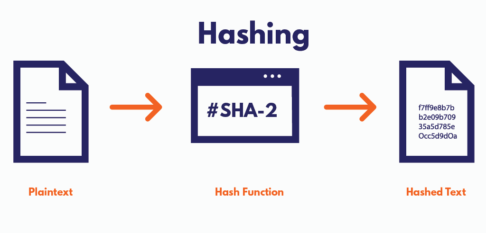

# Encription of secrets

## Difference between hashing and encription

Hashing uses a hash function. When our information, like a password, goes through the hash function, we get a fixed-size, unique hash value. It is used for fast search and retrieval. It is most commonly used for passwords. Hash functions are irreversible, so we can never get the original password back.

The main difference between hashing and encryption is the fact that when we use an encryption key and algorithm, we are able to decrypt that value using the same key and algorithm.

## Password Based Derived Key Value

It uses the hashed value as the encryption key. It’s a modern aproach because it has a bigger computational cost which makes it less vulnurable to brute force attacks.

**DK = PBKDF2(Password, Salt, Pseudo-Random Function, numOfIterations, derivedKeyLength)**

PBKDF is a way we can make passwords more imune to brute force and dictionary attacks. It intentionaly slows down the proccess of encryption and decryption to make it harder on the attackers. It makes it only slightly harder on users but a lot harder on the attackers.

This algorithm works by using the user-entered password to generate the encryption key. The key is generated by first adding salt to the password, then hashing it n number of times. HMAC + SHA256 is the most commonly used hashing function for this. The number of times the password + salt is hashed is set as a parameter. Length of the output is set as a parameter.

Pros

It is intentionally computation-heavy by using multiple iterations, which makes brute force attacks impractical. It also uses salt, which disables rainbow dictionary use. The length of the derived key is configurable.

Cons

It’s not memory-hard. Attackers can have specialized hardware, and since PBKDF requires little RAM, it can be efficiently implemented on a GPU, making password cracking faster.

bcrypt

It uses salt and multiple iterations. The salt and number of iterations are stored alongside the password hash. It’s used for password hashing and storage, but not for key derivation.

It’s resistant to rainbow tables and intentionally slow, but it’s also not memory-hard.

scrypt

scrypt is a key derivation function like PBKDF. It also uses salt and multiple hashing, but it differs from PBKDF and bcrypt because it is also memory-hard. Memory-hard means it requires a lot of RAM to compute, which means attackers can’t optimize by using a bunch of GPU cores, since each computation is made to require something like 64MB of RAM.

Argon2

Argon2id is the currently recommended approach. It’s also memory-hard,  but the difference from bcrpyt is that it also supports parallelism better.

It takes a password + salt + 3 parameters:

- time cost – how many iterations
- memory cost – how much RAM
- parallelism – how many threads/cores

It takes a large chunk of RAM, and then performs reads and writes to that memory and derives the encryption key or hash at the end. This makes it harder and more expensive for brute force attacks, again even when hackers have advance hardware.

The only downside is that it isn’t supported by older software, so it won’t work for legacy systems.

## Symetric algorithms

A symmetric algorithm means we use the same key to both encrypt and decrypt some text.

It’s used in the second step after something like PBKDF generates the encryption key.

The most common encryption algorithm is Advanced Encryption Standard.

It works like this:

- we have some plaintext we want to encrypt
- we use our PBKDF to generate us the encryption key from the user password
- since these algorithms work on fixed-size data (like 128 bits) we need to pick mode of operation for longer data (GCM, CBC, CTR). These define how the blocks are chained or combined together
- we encrypt using the key and nonce (unique rand value per encryption to prevent repetition)
- we get back ciphered text, a tag (if using authenticated mode like GCM) and we need to keep the nonce for decryption
- now the receiver can use the password that only he and the sender know to decrypt
- these algorithms depend on the password being a secret

Configurable params:

- block size: 128, 192, 256 bits
- IV - initialization vector
- mode of operation: GCM, CBC, CTR
    - ECB (Electronic Codebook) = simplest one, encrypts each block independantly, leaks patterns, not safe to use
    - CBC (Cipher Block Chaining) = each block is XORed with the previous ciphertext block, requires IV, and doesn’t leak pattern
    - CFB (Cipher Feedback) =  self-synchronizing stream cipher, encrypts small units  (bytes, bits).
    - CTR (Counter Mode) = turns block cipher into a stream cipher by encrypting a counter value for each block, so it’s parallelizable and fast.
    - GCM (Galois/Counter Mode) = this one combines CTR mode with integrity/authentication using Galois field math, modern approach

Some other symmetric algorithms are:

- ChaCha20 - stream cypher designed for speed and security
    - it’s better then AES on mobile and embeded devices
    - configurable params:
        - key size
        - nonce
        - counter
- DES
    - deprecated, uses 56-bit key which is insecure, 3DES uses 112 or 168 bits but it’s still vulnurable to modern attacks
    - conf params:
        - key size
        - modes (same as other block cyphers)
- Blowfish/Twofish
    - blowfish is no longer recommend due to smaller block sizes, twofish more secure
    - conf params:
        - key size -  448 bits (blowfish), 256 (twofish)
        - modes of operation (same as AES)

Currently AES-GCM is the best practice while ChaCha20 is best on devices whose hardware doesnt support AES.

Best practices:

- use authenticaed encryption - use AEAD modes (AES-GCM) to ensure confidentiality + integrity, so nobody can change the message without being detected
- never reuse the same nonces or initialization vectors
- use argon2id or pbkdf2 to get the keys from passwords
- use 256-bit keys
- change keys periodically

Current trusted providers (and vulnerabilities):

- for Python:
    - cryptography - no known vulnerabilities
    - PyNaCl (Python binding for libsodium) - no known vulnerabilities
- for Java:
    - BouncyCastle - no acitve vulnerabilites, as long as you use the latest version
    - JCA (Java Crypto Architecture)
        - SunJCE - no vulnerabilities if you use the current JDK versions
        - Amazon Correto Crypto Provider (ACCP) - no vulnerabilities
- C/C++
    - OpenSSL - no vulnerabilities, if you use secure configurations and latest version
    - libsodium - safe and modern, no vulnerabilites
- JS
    - SubtleCrypto  - safe if used correctly, avoid modes like AES-CBC without authentication
    - libsodium.js - as secure as libsodium

## Recommendations

For key derivation use Argon2id with the right parameters, 64MB memory, 3+ iterations, 2 threads. Generate salt randomly and store it with the ciphered text.

Use AES-256-GCM or ChaCha20-Poly1305 for authenticated encryption.  Don’t use ECB.

Always generate unique, random nonces and initialization vectors for each encryption operation.

Use the most recent versions of reliable libraries like cryptography, libsodium and BouncyCastle. Check if they have recent CVEs, if they do update to patched versions.

Never store decryption keys, always derive them from master password when needed.