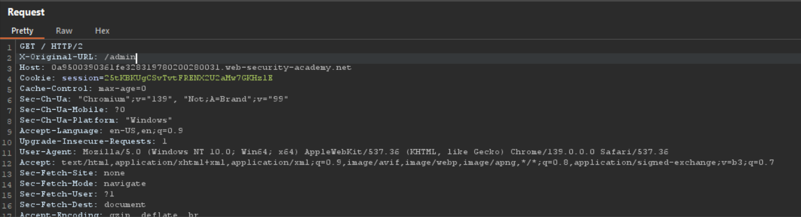
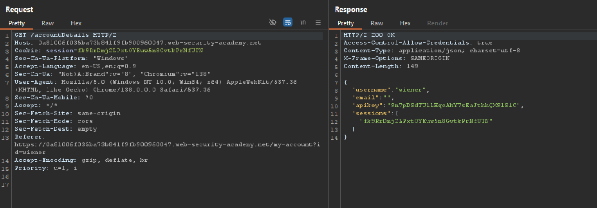

# Access Control

## O klasi

Napadi klase Access Control karakterišu se pristupom funkcionalnostima koje nisu namenjene za ulogu datog korisnika. Ovi napadi se javljuju u sistemima sa rupama u logici za autorizaciju, gde maliciozni korisnici zaobilaze predviđene dozvole i tako dolaze do neautorizovanih privilegija.

## Uticaji exploit-ovanja

- Neautorizovan pristup podacima, kao i njihovo modifikovanje i brisanje
- Obavljanje radnji predviđenih za druge korisnike
- Pristup zaštićenim API-jima, datotekama i funkcijama sistema
- Zaobilaženje plaćanja i licenciranja
- Kompromitovan integritet i poverljivost sistema

## Ranjivosti koje omogućuju napad

- Nedostajuća provera nakon autentikacije
- IDOR (Insecure direct object references) - ID-jevi su dostupni bez provere da li je korisnik autorizovan da ih koristi
- Nevalidirane URL adrese koje maliciozni korisnici mogu da pogode i ručno im pristupe
- Kontrola pristupa samo u UI elementima na strani klijenta i njen nedostatak na serverskoj strani

## Kontramere

- Obezbediti autorizaciju na serverskoj strani za svaki zahtev
- Deny-by-default politika sa eksplicitnim davanjem dozvola
- RBAC/ABAC
- Izbegavanje otkrivanja predvidljivih ID-jeva, korišćenje UUID-jeva
- Logovanje svih neuspelih kontrola pristupa radi istrage

# Access Control Labs

## Lab 1 - Unprotected admin functionality (Apprentice)

Dodavanjem /robots.txt na kraj URL-a dolazi se do robots.txt fajla. U njemu je skrivena putanja do administratorskog panela.

Dodavanjem /administrator-panel na kraj URL-a dolazi se do administratorskog panela.

Klikom na Delete dugme pored carlosovog imena zadatak je rešen.

## Lab 2 - User role controlled by request parameter (Apprentice)

Administratorski panel je blokiran za sve korisnike koji nemaju ulogu administratora.

Ukoliko se ulogujemo kao redovni korisnik, pod Network na developer settings nalazimo Cookie koji sadrži informaciju o tome da li korisnik ima ulogu administratora.

Pod Application moguće je promeniti vrednosti svih trenutnih kukija na brauzeru, uključujući i polje Admin.

Promenom polja na true dobijamo pristup administratorskom panelu.

Klikom na Delete dugme pored carlosovog imena zadatak je rešen.

## Lab 3 - URL-based access control can be circumvented (Practitioner)

Administratorski panel je blokiran za sve korisnike koji nemaju ulogu administratora.

Intercept-ovanjem zahteva preko Burp Suite alata nam omogućuje da ga čitamo.

Administratorskom panelu se sada može pristupiti odavanjem X-Original-URL headera i menjanjem URL-a pre nego što se zahtev pošalje.

Klikom na Delete dugme pored carlosovog imena zadatak je rešen.

## Lab 4 - Method-based access control can be circumvented (Practitioner)

Ukoliko se ulogujemo kao administrator, dobijamo mogućnost menjanja uloga svih korisnika. Preko Burp Suite Interceptor-a za operaciju Upgrade i korisnika sa imenom carlos dobijamo sledeći izgled zahteva.

Ukoliko pokušamo da pošaljemo isti zahtev dok smo ulogovani kao redovni korisnik (kopiranjem session kukija sa drugog brauzera i lepljenjem ga na Cookie header u zahtevu), sistem nas obaveštava da taj korisnik nije autorizovan za akciju menjanja uloge.

Međutim, menjanjem metode na GET, akcija je omogućena i sa kukijem redovnog korisnika.

Slanjem tako izmenjenog zahteva (sa korisničkim imenom wiener) zadatak je rešen.

## Lab 5 - Multi-step process with no access control on one step (Practitioner)

Ukoliko se ulogujemo kao administrator, dobijamo mogućnost menjanja uloga svih korisnika. Preko Burp Suite Interceptor-a za konfirmaciju posle operacije Upgrade i korisnika sa imenom carlos dobijamo sledeći izgled zahteva.

Ukoliko pokušamo da pošaljemo isti zahtev dok smo ulogovani kao redovni korisnik (kopiranjem session kukija sa drugog brauzera i lepljenjem ga na Cookie header u zahtevu), sistem nam dozvoljava. Provera autorizacije nije prikladno podešena za poslednji zahtev koji se šalje pri akciji menjanja uloge korisnika.

Slanjem tako izmenjenog zahteva (sa korisničkim imenom wiener) zadatak je rešen.

# CORS

## O klasi

CORS (Cross Origin Resource Sharing) je bezbednosni mehanizam na brauzeru koji kontroliše koji eksterni domeni mogu da vrše interakciju sa resursima veb-aplikacije preko JavaScript-a. Ukoliko je loše podešen, maliciozni sajtovi mogu da šalju autentikovane zahteve ka meti i pristupe osetljivim podacima sa njenog brauzera.

## Uticaji exploit-ovanja

- Krađa osetljivih podataka: ličnih informacija, tokena, podataka sa platne karticež
- Preuzimanje naloga krađom sesije
- Neautorizovano slanje autentikovanih zahteva u ime žrtve
- Pristup unutrašnjim API-jima ili resursima koji su obično ograničeni poverljivim Origin-ima

## Ranjivosti koje omogućuju napad

- Previše opšte definisan Access-Control-Allow-Origin header, npr. "*" (propušta svaki Origin)
- Upisivanje nepoverljivih izvora u CORS belu listu
- Stavljanje Access-Control-Allow-Credentials header-a na true
- Zaobilaženje validacije Origin header-a pre odgovora

## Kontramere

- Eksplicitna definicija liste dozvoljenih Origin-ova
- Ukoliko je Access-Control-Allow-Credentials omogućeno, Access-Control-Allow-Origin ne sme biti "*"
- Validacija Origin header-a na serverskoj strani pre odgovora
- Limitacija dozvoljenih HTTP metoda i header-a u CORS konfiguraciji
- Redovno logovanje CORS podešavanja za spoljne programe i API-je (u slučaju neprimetnog menjanja podešavanja u third-party servisima)

# CORS Labs

## Lab 1 - CORS vulnerability with basic origin reflection (Apprentice)

Propuštanjem login funkcionalnosti kroz Burp Suite Interceptor primećeno je da je korisnikov API ključ dobavljen na endpoint-u "/accountDetails". U odgovoru se pojavljuje header Access-Control-Allow-Credentials: true, što nagoveštava da je CORS podržan.

Kopiranjem zahteva na Burp Suit Repeater i slanjem istog sa dodatim Origin headerom i nasumičnom adresom, uočićemo da je vraća u odgovoru.

Sledi zaključak da je CORS podešen tako da prihvata bilo koji Origin.

Na exploit serveru potrebno je ukucati sledeći kod u telo zahteva kako bi se izvršio napad na administratorov brauzer.

Dostavljanjem exploit-a žrtvi i pristupanjem u access log pronađen je API ključ administratora kao jedno od polja iz odgovora.

Zadatak je rešen unosom administratorovog API ključa.

## Lab 2 - CORS vulnerability with trusted null origin (Apprentice)

Propuštanjem login funkcionalnosti kroz Burp Suite Interceptor primećeno je da je korisnikov API ključ dobavljen na endpoint-u "/accountDetails". U odgovoru se pojavljuje header Access-Control-Allow-Credentials: true, što nagoveštava da je CORS podržan.

Kopiranjem zahteva na Burp Suit Repeater i slanjem istog sa dodatim Origin headerom i vrednošću null, uočićemo da je vraća u odgovoru.

Sledi zaključak da je CORS podešen tako da prihvata null Origin.

Na exploit serveru potrebno je ukucati sledeći kod u telo zahteva kako bi se izvršio napad na administratorov brauzer. iframe sandbox šalje zahtev sa null Origin-a.

Dostavljanjem exploit-a žrtvi i pristupanjem u access log pronađen je API ključ administratora kao jedno od polja iz odgovora.

Zadatak je rešen unosom administratorovog API ključa.

## Lab 3 - CORS vulnerability with trusted insecure protocols (Practitioner)

Propuštanjem login funkcionalnosti kroz Burp Suite Interceptor primećeno je da je korisnikov API ključ dobavljen na endpoint-u "/accountDetails". U odgovoru se pojavljuje header Access-Control-Allow-Credentials: true, što nagoveštava da je CORS podržan.

Kopiranjem zahteva na Burp Suit Repeater i slanjem istog sa dodatim Origin headerom i adresom koja se završava URL-om zadatka, uočićemo da je vraća u odgovoru.

Sledi zaključak da je CORS podešen tako da za Origin prihvata bilo koji poddomen koji se završava host domenom. Jedan zahtev čiji URL zadovoljava ovaj format se nalazi u funkcionalnosti Check Stock za bilo koji proizvod. Moguće je nakačiti maliciozni kod na njegov otkriven parametar productID.

Na exploit serveru potrebno je ukucati sledeći kod u telo zahteva kako bi se izvršio napad na administratorov brauzer.

Dostavljanjem exploit-a žrtvi i pristupanjem u access log pronađen je API ključ administratora kao jedno od polja iz odgovora.

Zadatak je rešen unosom administratorovog API ključa.

#

Dva preostala zadatka težine Practitioner urađena su u oblasti Clickjacking.
