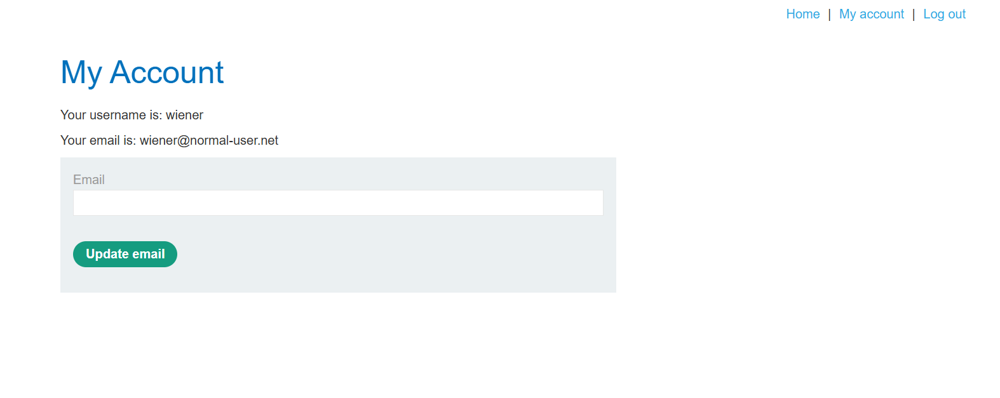
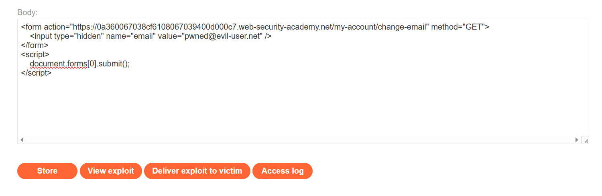
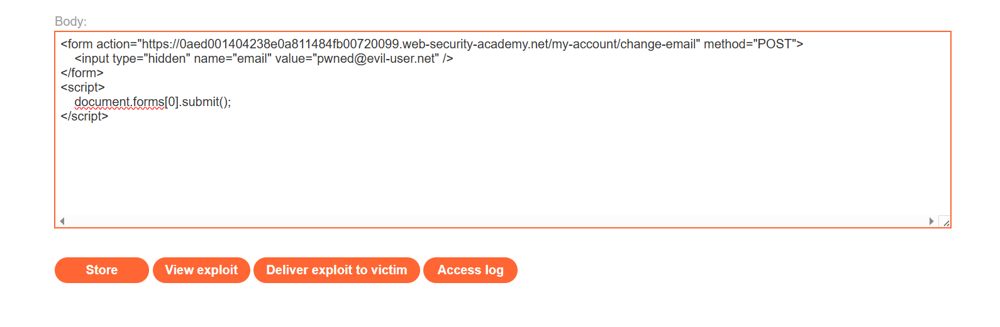
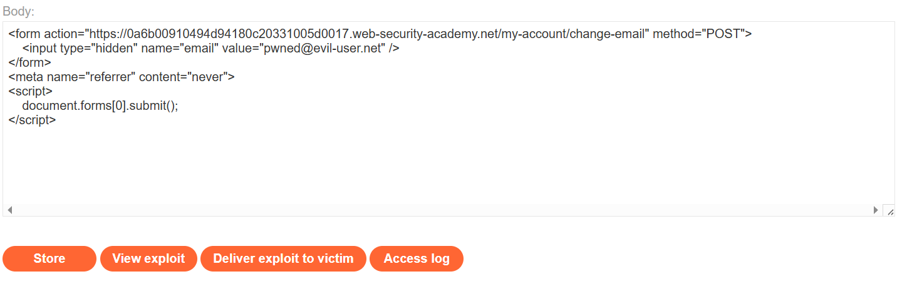

# CSRF

Cross-site request forgery je ranjivost koja se javlja na klijentskoj strani. Dozvoljava napadaču da natera korisnika da uradi nešto što nije nameravao obilazeći _same origin_ pravilo koje inače sprečava komunikaciju između različitih sajtova.


## Uticaj napada

Ovim napadom, napadač prouzrokuje situaciju u kojoj korisnik izvršava neku akciju ne misleći na posledice i kao rezultat toga obično gubi kontrolu nad svojim nalogom ili resursima. Problem je naročito velik ako se napadne korisnik koji ima neki privilegovan status u sistemu i onda napadač dobije pristup osetljivim podacima ili funkcionalnostima.


## Ranjivosti u softveru koje dovode do napada

* Bitna akcija - motivacija za napad, postoji akcija privlačna napadačima jer može da se iskoristi na neki profitabilan način (privilegovana ili na nivou jednog korisnika)

* Identifikacija sesija samo na osnovu kolačića

* Predvidivi parametri zahteva - sve parametre zahteva potrebne da se izvrši akcija napadač može da zna ili pogodi (ako menja lozinku, trebalo bi tražiti trenutnu lozinku koju napadač ne može tako lako da zna)

Ako su ispunjeni ovi uslovi, žrtva napada može da poseti sajt napadača koji liči na pravi sajt. Sajt napadača šalje zahtev ka pravom sajtu, pretraživač automatski dodaje kolačić iz sesije na pravom sajtu ako je žrtva prijavljena tamo. Koristeći validni kolačić, pravi sajt identifikuje korisnika i izvršava zahtev sa parametrima koje je postavio napadačev sajt.

Umesto kolačića isti scenario može da se desi i sa sertifikatima ili _HTTP Basic authentication_ mehanizmom ako se potrebni podaci automatski postavljaju.

Napad se ostvaruje tako što se maliciozni kod postavi na neko mesto koje napadač kontroliše odakle će žrtve otići na sajt napadača. Često se to radi preko mejlova, poruka ili komentara u okviru drugih sajtova. Ako akcija može da se izvrši kroz jedan GET zahtev, napadač nema potrebu za svojim lažnim sajtom, nego ceo zahtev direktno šalje ka ranjivom serveru.


## Kontramere

### CSRF tokeni

Token je jedinstvena, tajna vrednost koja se teško pogodi. Kreira ga server i deli sa klijentom. Kada se šalje zahtev koji pokreće osetljivu akciju, treba da se uključi i taj token u zahtev. Često se uključuje kao skriveni parametar forme ili se uključuje u zaglavlje zahteva.

Problemi koji se javljaju pri validaciji tokena su:
- validacija samo za POST zahteve, ali se preskače za GET
- validacija se samo vrši ako je token prisutan, ali se ignoriše ako ga nema
- server ne proverava čiji je token, nego je dovoljno da se poklapa sa bilo kojim tokenom iz skupa mogućih (dodeljenih, aktivnih), pa napadač može da proturi svoj token umesto žrtvinog
- token je vezan za kolačić koji ne prati sesiju, obično kad se koriste različiti radni okviri za sesije i CSRF; napadač može da nametne svoj kolačić i token žrtvinom pretraživaču
- token je ponovljen u kolačiću i onda se porede te 2 pojave umesto da se čuvaju tokeni na serverskoj strani; napadač ovde može da smisli svoj token i postavi ga na odgovarajuća mesta u zahtevu da bi zaobišao ovu meru


### _SameSite_ kolačići

Bezbednosni mehanizam na nivou pretraživača određuje kada se u zahtev uključuju kolačići sa drugih sajtova. Vrednost može da bude _strict_, _lax_ ili _none_ i postavlja se u okviru _Set-Cookie_ atributa.

_Strict_ šalje kolačić samo u okviru istog sajta. Ovo se preporučuje za osetljive akcije, promene podataka ili resurse rezervisane za autentifikovane korisnike. Predstavlja najsigurniju opciju, ali negativno utiče na UX.

_Lax_ šalje kolačić samo ako je u pitanju GET zahtev i ako je zahtev rezultat direktne navigacije korisnika (klik na link). Ovim se izbegava slanje kolačića u POST zahtevima ili u pozadinskim zahtevima koje pokreće skripta ili neki deo DOM stabla. Ovo je podrazumevana vrednost na _Chrome_-u od 2021. ako se ne navede drugačije. 

_None_ se koristi da se onemogući _SameSite_ zaštita. Ovo je podrazumevana vrednost u većini drugih pretraživača (osim _Chrome_-a). Ima smisla da se koristi kad spoljna strana treba da pristupi ili kad se ne pristupa osetljivim resursima. U ovom slučaju mora da se koristi i atribut _Secure_ da bi se naglasilo da se kolačić šalje samo u HTTPS komunikaciji, inače se kolačić odbacuje.

U proveri bezbednosti sistema bitno je proveriti i bezbednost srodnih domena ili komunikacije preko soketa. Kod kolačića koji koriste _lax_ ograničenje kao podrazumevanu opciju jer nije definisano koju treba da koristi, _Chrome_ čeka 2 minuta dok ne počne da primenjuje ograničenje otkad je postavljen kolačić zbog SSO mehanizma. Ovo može da se zloupotrebi ako se kolačić eksplicitno obnavlja i resetuje tajmer.


### Validacija na osnovu reference u zaglavlju

Referenca na URL sa kog se šalje zahtev (_Referer_) se proverava da li je u domenu aplikacije. Ovaj mehanizam zaštite je najmanje koristan od ponuđenih jer se relativno lako zaobilazi. Atribut uglavnom automatski dodaju pretraživači kad korisnik izazove slanje zahteva. Zbog privatnosti, postoje mnogi načini da se ovaj atribut promeni ili mimoiđe.

Problemi mogu da nastanu ako se validacija atributa preskače ako on nije prisutan u zaglavlju što se lako postiže postavljanjem _meta_ taga kao u zadatku 5. Takođe može se desiti da se proverava samo činjenica da li se domen pojavljuje kao deo vrednosti atributa koji napadači onda stave na početak ili dodaju kao parametar zahteva. Da bi se ovo izbeglo, pretraživači obično izbace _query_ deo vrednosti, mada i ovo je moguće isključiti ako je potrebno.


## Zadaci

### 1. CSRF ranjivost bez sigurnosnih mera
(_Lab: CSRF vulnerability with no defenses_)

Zadatak je bio da se promeni mejl na nalogu. Dati su korisničko ime i lozinka na osnovu kojih se prijavimo na sajt. Potom smo definisali _body_ na serveru napadača koji je postavljao vrednost novog mejla na svoju vrednost i slao zahtev ka sajtu na sledeći način:

```
<form action="https://0ad5003c038ad83081be588d00f900de.web-security-academy.net/my-account/change-email" method="POST">
    <input type="hidden" name="email" value="pwned@evil-user.net" />
</form>
<script>
    document.forms[0].submit();
</script>
```

Slika koja prikazuje početno stanje na stranici za menjanje mejla:


Kad se ovakav zahtev pošalje žrtvi, ona će promeniti mejl adresu na neku novu vrednost, ali će se umesto nje, mejl promeniti na ovaj sa servera napadača.


### 2. Validacija tokena zavisi od vrste zahteva
(_Lab: CSRF where token validation depends on request method_)

Zadatak je bio da se promeni mejl na nalogu. Dati su korisničko ime i lozinka na osnovu kojih se prijavimo na sajt. Potom smo definisali _body_ na serveru napadača koji je postavljao vrednost novog mejla na svoju vrednost i slao zahtev ka sajtu na sledeći način:


Jedina razlika u odnosu na prethodni zadatak je ta da smo promenili metodu sa POST na GET jer je u uslovu zadatka rečeno da će sistem proveravati CSRF token za POST zahteve, ali neće za GET zahteve.


### 3. Nedostajući CSRF token
(_Lab: CSRF where token validation depends on token being present_)

Zadatak je bio da se promeni mejl kao u prethodnim zadacima, s tim što sada treba da iskoristimo činjenicu da server ne proverava token ako se on ne pošalje u zahtevu. Koraci rešenja su analogni koracima za 1. zadatak.




### 4. Promena vrste zahteva da se zaobiđe _SameSite Lax_
(_Lab: SameSite Lax bypass via method override_)

Zadatak je bio da se promeni mejl tako što se iskoriti činjenica da Lax zaštita propušta GET zahteve ako se šalju direktnim klikom. Na serveru napadača smo definisali _body_ koji je preusmerio zahtev na slanje zahteva za promenu lozinke:

```
<script>
    document.location = "https://0a2e00e004b9a0f680cd031200c80079.web-security-academy.net/my-account/change-email?email=pwned@web-security-academy.net&_method=POST";
</script>

```


### 5. Validacija _Referer_ atributa se vrši samo ako je prisutan
(_Lab: CSRF where Referer validation depends on header being present_)

Zadatak je bio da se promeni mejl tako što se iskoristi činjenica da server proverava vrednost _Referer_ atributa samo ako se pošalje, pa jedino što treba da se uradi u odnosu na prethodne zadatke je da se spreči njegovo uključivanje u zahtev pre slanja. To radimo pomoću _meta_ taga kao na slici ispod.

