# Ranjivosti u poslovnoj logici

Pod ranjivostima u poslovnoj logici podrazumevamo sve greške u dizajnu i implementaciji aplikacije koje mogu da se iskoriste za neki napad. Ove ranjivosti obično nastaju jer se ne predvide svi načini na koje može aplikacija da se upotrebi, odnosno, zlouptrebi i nije ih lako primetiti ako se ne traže. Logika služi da uvede pravila i ograničenja kako se reaguje na određene ulaze i scenarije i tako spreče korisnike da naprave štetu. Ako aplikacija ne reaguje adekvatno na neočekivane ulaze, može da dođe do problema. Ranjivosti u logici zavise od same aplikacije i variraju u odnosu na kontekst, pa je teško da se detektuju pomoću automatizovanih rešenja. Umesto toga, potrebno je poznavanje problema i ciljeva napadača, pa ih je potrebno testirati kako bi se obezbedio što veći nivo bezbednosti. 

## Uticaj napada

Uticaj je veoma širok jer zavisi u velikoj meri od samog softvera. Ranjivost direktno zavisi od same funkcionalnosti na koju utiče njeno iskorišćenje. Često se koriste da se napadnu funkcionalosti vezane za autentifikaciju (što omogućava pristup osetljivim resursima i privilegovanim akcijama) ili finansijske transakcije.


## Uzroci

Ranjivosti u poslovnoj logici obično nastaju jer razvojni tim pogrešno proceni kako će korisnici koristiti njihov softver. Primer je nedovoljna provera korisničkog ulaza i greška u rukovanju neočekivanim vrednostima. Još jedan razlog je činjenica da su veliki projekti često toliko obimni da programeri nemaju uvid u ceo projekat, pa ne mogu u potpunosti da razumeju softver u celini. Npr. pretpostavi se nešto o ulazu iz jedne komponente u drugu što u stvarnosti ne važi.

### Primeri ranjivosti

#### Poverenje prema klijentskoj strani

Pretpostavka da će korisnici pristupati serveru samo preko sajta dovodi do problema ako se validacija ulaza radi samo na klijentskoj strani i preskače na serveru. U tom slučaju, napadač može da koristi neki od alata za presretanje zahteva i izmeni podatke pre nego što se pošalju do servera i tako preskoči validaciju.


#### Rukovanje neočekivanim ulazom

Aplikacija mora da se osigura da ulazni korisnički podaci poštuju poslovna pravila sistema. Klasičan primer je prodavnica koja mora da vodi računa o tome da korisnik ne može da naruči više proizvoda nego što postoji na stanju. Programeri moraju da uzmu u obzir šta sve može biti ulaz u sistem iako on možda neće imati smisla i da obezbede odgovarajuću reakciju na takvu besmislenu vrednost. U suprotnom, ova situacija može da se iskoristi u štetne svrhe. Još jedan primer je prenos novca u banci, gde bi mogla da se prosledi negativna vrednost kao iznos, što bi obrnulo smer transakcije.

Kada se testiraju ovakve situacije, treba da se probaju vrednosti koje nisu uobičajene poput neobično velikih ili malih brojeva, dugih stringova ili drugih tipova podataka. Time se ispituju ograničenja koje aplikacija postavlja i šta se desi ako se ona prekorače i tako se pronalaze slabe tačke u sistemu. 


#### Pretpostavke o ponašanju korisnika

Pogrešne pretpostavke o tome kako će se korisnik ponašati su najčešći uzrok logičkih ranjivosti. Varijacije su velike, pa opisujemo neke primere u nastavku.

* Korisnici koji su prošli provere kontrole pristupa i autentifikacije su korisnici kojima verujemo. Problem nastaje ako pretpostavimo da ćemo moći neodređeno dugo da verujemo njima i podacima koji stižu od njih. Ako se u ostatku aplikacije primenjuju slabije mere provere, mogu da se jave slabe tačke na tim mestima.

* Korisnici neće uvek popuniti obavezna polja. Iako pretraživači mogu da se osiguraju da obavezna polja neće ostati prazna, napadači mogu da presretnu zahteve i promene ili uklone parametre. U zavisnosti od toga koji su parametri prosleđeni, može da se desi da će se pogoditi druge funkcije na serverskoj strani. Tako napadači mogu da pristupe funkcionalnosti kojima ne bi smeli. Ovaj napad se proba tako što se uklanjaju jedan po jedan parametar, da bi se došlo do različitih putanja, uklanjaju se i vrednost i ime parametra i ovo se vrši za svaki korak nekog procesa. Uklanjaju se parametri iz putanje, tela zahteva ili kolačići.

* Korisnici neće uvek ispratiti predviđeni tok. Ponovnim slanjem zahteva u proizvoljnom redosledu može da dođe do neočekivanog ponašanja koje može biti štetno. Ovim napadima često dolazi do grešaka u sistemu, pa poruke o njima mogu da otkriju ideje za dalje korake u sledećem napadu.


#### Mane svojstvene domenu

Ranjivosti su često i čvrsto vezane za domen problema. Česta meta su funkcionalnosti koje računaju popuste u onlajn prodavnicama. Treba obratiti pažnju na algoritme koji se pokreću korisničkim akcijama i na uslove koji treba da važe da bi se oni primenili. Da bi se softver zaštitio od ovakvih napada, potrebno je da razumemo motivaciju i krajni cilj napadača u određenom kontekstu. Testeri zato treba da se upoznaju sa domenom čitajući dokumentaciju ili konsultujući sa stručnjacima.


#### Otkrivena enkripcija (_encryption oracle_)

Uzrok problema je ako se neki podatak koji je korisnik uneo šifruje i onda na neki način ta šifrovana verzija ponovo dospe do korisnika. Ovakav podatak je poznat pod imenom _encryption oracle_. Na ovo mesto napadač može da unese bilo šta i da dobije validnu šifrovanu verziju koju dalje koristi po potrebi. Problem postaje još gori ako postoji još neki unos koji nudi dešifrovanje podataka jer može da otkrije očekivanu strukturu podataka i da ubrza generisanje vrednosti za napade. Ove okolnosti ne garantuju da će napad biti uspešan jer i to zavisi od toga koje funkcionalnosti koriste isti algoritam šifrovanja.


#### Različita obrada imejl adresa

Neki sajtovi koriste imejl adrese da bi zaključili kojoj organizaciji pripada njen vlasnik. Dešava se da se ovo radi na drugačiji način u različitim delovima aplikacije što nekad dovodi do problema. Napadači mogu da prikriju delove adrese tako da na jednom mestu validacija bude uspešna, a da ima neki štetni efekat pri daljoj obradi. Obično se ovaj napad koristi za dobijanje pristupa zaštićenim delovima aplikacije.


## Kontramere

Da bi se sprečili ovakvi napadi, treba da se osiguramo da razvojni tim i tim za testiranje razumeju domen aplikacije i poslovna pravila koja se primenjuju. Takođe, drugi bitan korak je da se razvoj ne oslanja na pretpostavke o ponašanju korisnika i ostalih delova aplikacije. Umesto toga, treba jasno da se definiše šta je ulaz i izlaz iz svake komponente i da se podaci i pretpostavke o njima proveravaju na svakom potrebnom koraku.

Da bi se ovo postiglo, postoje pravila kojih bi se trebalo pridržavati:

* održavanje jasne dokumentacije o dizajnu aplikacije i protoku podataka sa definisanim pretpostavkama u svakom koraku nekog procesa
* pisanje čistog koda i dokumentacije o komplikovanim procesima da bi mogla da se isprati logika tokom implementacije i testiranja
* obratiti pažnju na zavisnosti u kodu i na posledice koje mogu da nastanu ako se one korumpiraju.


## Zadaci


### 1. Provera podataka samo na klijentskoj strani
(_Lab: Excessive trust in client-side controls_)

Zadatak je da se kupi jakna po izmenjenoj ceni tako što će se iskoristiti činjenica da se validacija podataka radi samo na klijentskoj strani. Prvo se prijavimo pomoću datog korisničkog imena i lozinke. Vidimo da jakna košta preko 1000 dolara, a mi imamo 100. U _Burp_-u presretnemo zahtev koji dodaje jaknu u korpu i promenimo parametar tela zahteva _cena_ na 4. 
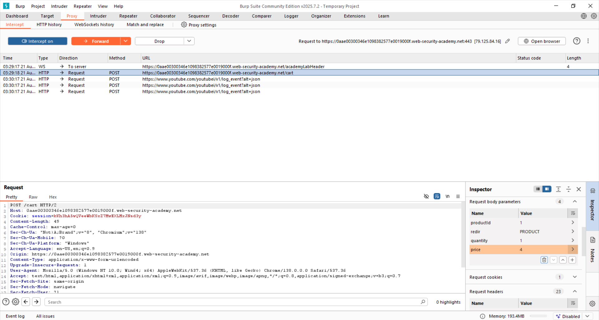
Potom prosledimo izmenjeni zahtev i dalje vidimo da je jakna dodata u korpu po ceni od 4 centa. Dalje prosledimo zahtev za kupovinu i zadatak je rešen.
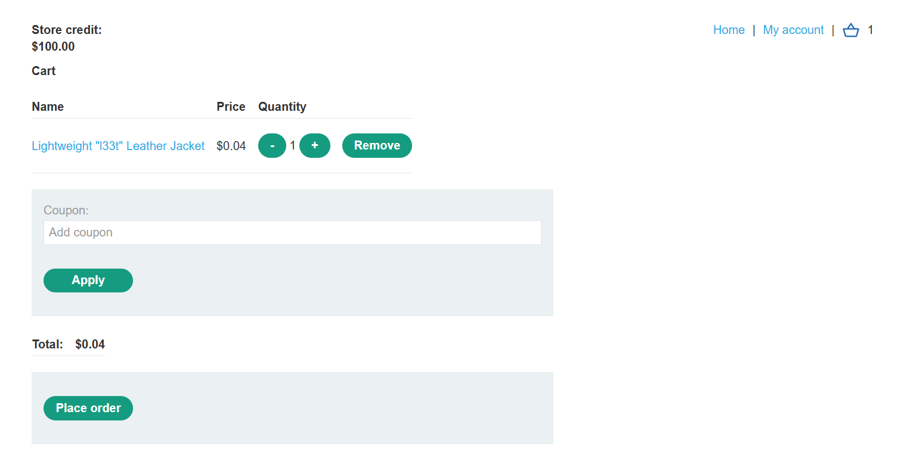


### 2. Rukovanje neočekivanog korisničkog ulaza
(_Lab: Inconsistent handling of exceptional input_)

Zadatak je da se registrujemo kao administrator i obrišemo korisnika po imenu _carlos_.

Ako pokušamo da pristupimo url-u sa dodatim _/admin_ na kraju, dobijemo poruku da ovoj stranici pristup imaju samo članovi _DontWannaCry_.
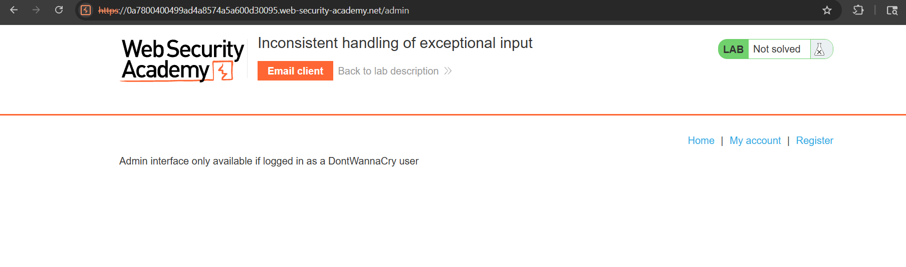

Na stranici za registraciju vidimo da svi njihovi članovi imaju mejl koji ima isti domen: _@dontwannacry.com_.
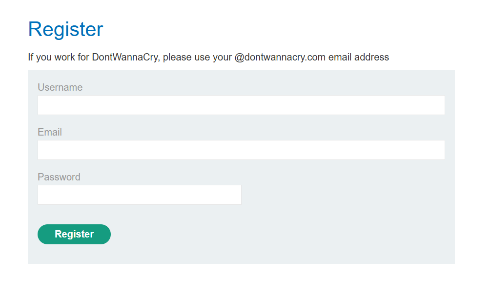

Ako pri registraciji pokušamo da upišemo u polje za mejl string duži od 255 karaktera, pri uspešnoj registraciji možemo da primetimo da se mejl skratio na prvih 255 karaktera.

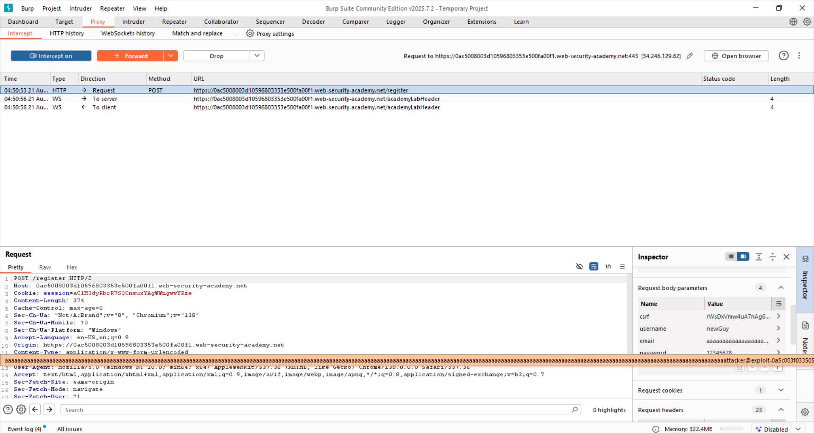

S tim na umu, koristimo dati pajton kod da generišemo mejl koji ćemo iskoristiti pri registraciji takav da se završava traženim domenom kada se skrati, ali da i dalje nama stigne mejl za potvrdu registracije.

```
a = '@dontwannacry.com'
while len(a) < 255:
    a = 'd' + a
a += '.exploit-0a5c003f033505d680de525d016f0096.exploit-server.net'
print(a)
```

Rezultat je _dddddddddddddddddddddddddddddddddddddddddddddddddddddddddddddddddddddddddddddddddddddddddddddddddddddddddddddddddddddddddddddddddddddddddddddddddddddddddddddddddddddddddddddddddddddddddddddddddddddddddddddddddddddddddddddddddddddddddddddd@dontwannacry.com.exploit-0a5c003f033505d680de525d016f0096.exploit-server.net_. 

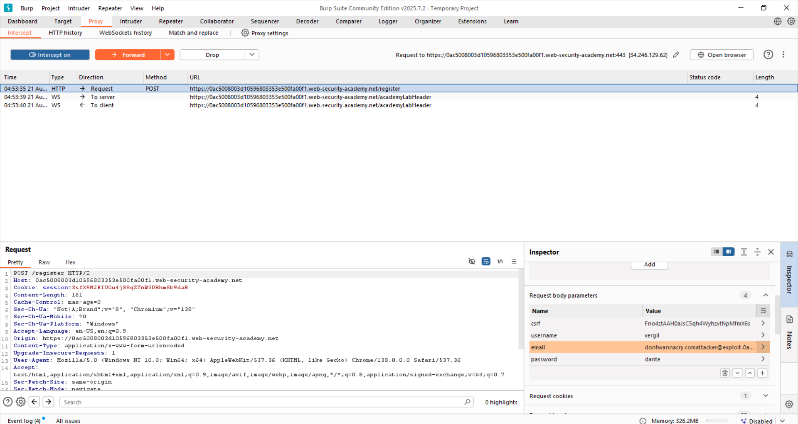

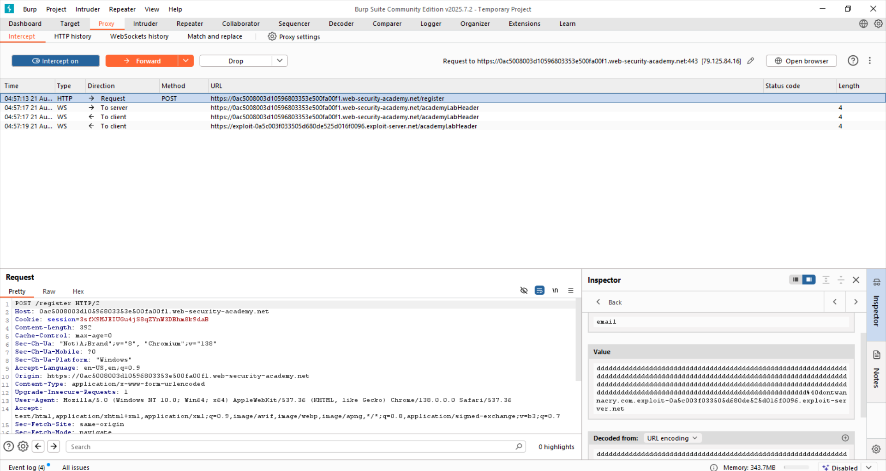

Kada se skrati na 255 karaktera, izgledaće ovako: _dddddddddddddddddddddddddddddddddddddddddddddddddddddddddddddddddddddddddddddddddddddddddddddddddddddddddddddddddddddddddddddddddddddddddddddddddddddddddddddddddddddddddddddddddddddddddddddddddddddddddddddddddddddddddddddddddddddddddddddd@dontwannacry.com_ i server će misliti da je registrovani član deo _DontWannaCry_ i dati mu administratorska prava.

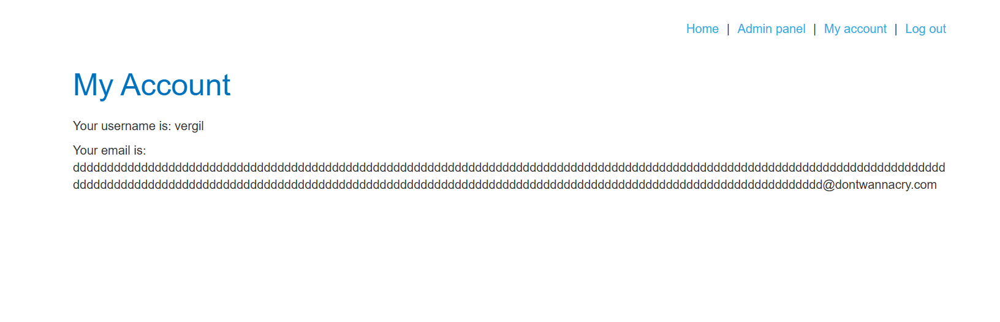

Sada vidimo da novi korisnik ima administratorki pristup stranici sa korisnicima na kojoj biramo da obrišemo traženog korisnika.

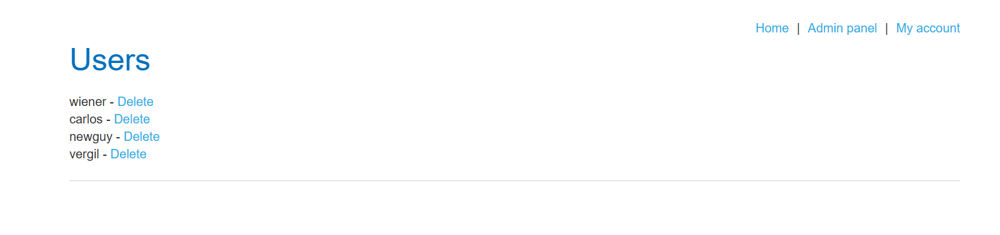


### 3. Mana u promeni lozinke
(_Lab: Password reset broken logic_)

Zadatak je da se promeni Karlosova lozinka i pristupi stranici njegovog profila znajući da postoji ranjivost u promeni lozinke. Na stranici za prijavu odaberemo opciju da smo zaboravili šifru. Na mejl nam je stigao link za stranicu za menjanje lozinke. Postavimo novu šifru _123_ i presretnemo zahtev. U telu zahteva promenimo username sa _wiener_ na _carlos_ (i obrišemo kolačiće, nije neohodan korak, ali dokazuje da se sama vrednost kolačića ne proverava).

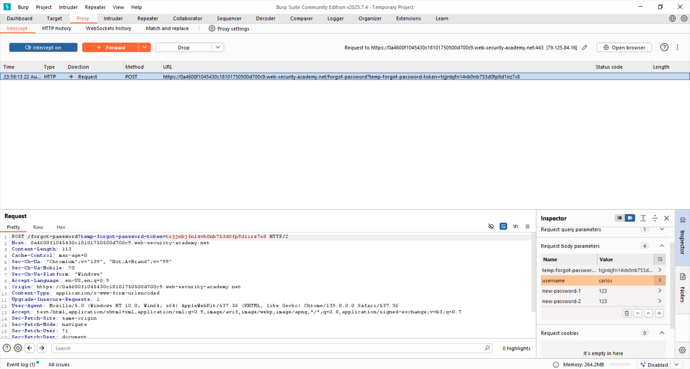

Tako izmenjen zahtev pošaljemo dalje i pokušamo da se ulogujemo kao Karlos uz novu lozinku. Pokušaj je uspešan. 

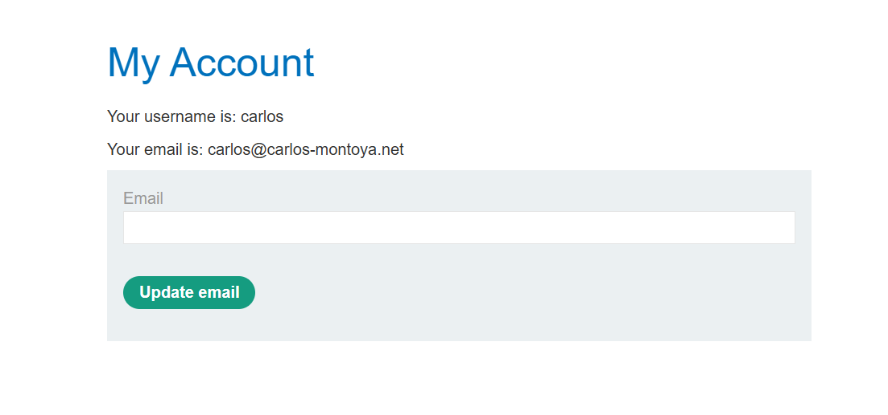


### 4. Mana u poslovnim pravilima
(_Lab: Flawed enforcement of business rules_)

Zadatak je da se kupi jakna. Kada pristupimo sajtu, vidimo da postoji kupon za nove mušterije sa kodom NEWCUST5.

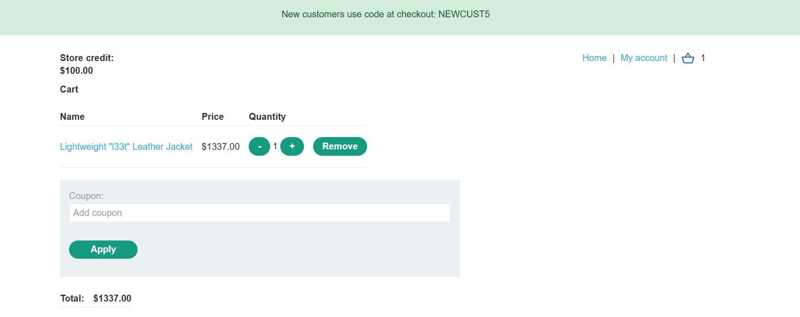

Ako pokušamo da se prijavimo na vesti, dobijemo obaveštenje da smo dobili kupon SIGNUP30.

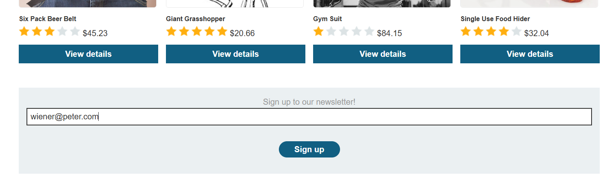

Dodamo jaknu u korpu, odemo na kasu i unesemo prvi kod. Vidimo da je 5$ skinuto sa računa. Ako pokušamo ponovo da primenimo isti kupon, dobijemo grešku. Primenimo drugi kod koji skine 30% originalne cene. Nakon toga, pokušamo ponovo da primenimo prvi kod i vidimo da je uspešno skinuto još 5$. Naizmenično ponavljamo zahteve za primenu ova 2 kupona u _Burp Repeater_-u dok cena ne bude 0$.

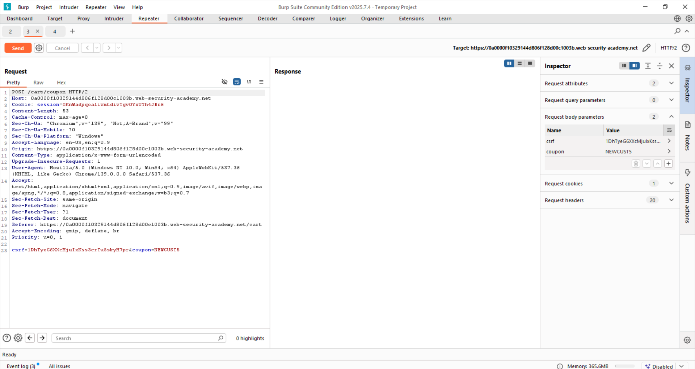

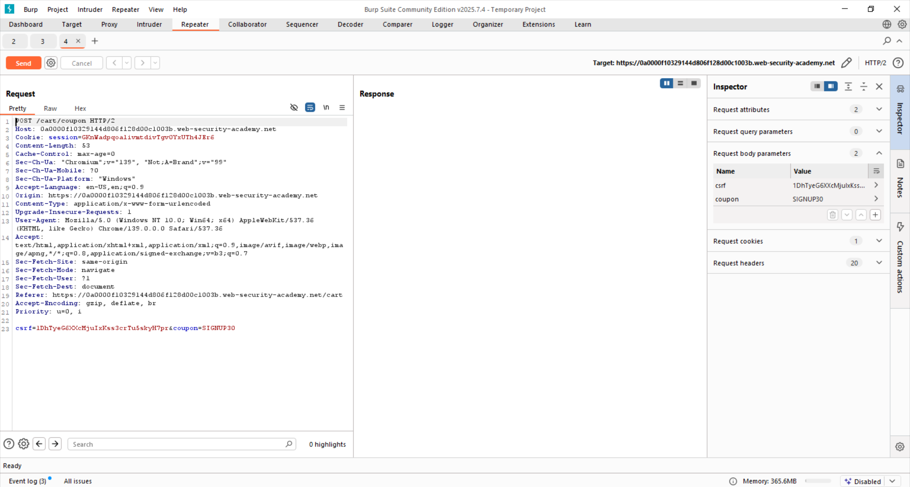

Nakon toga, kupimo jaknu bez naknade.

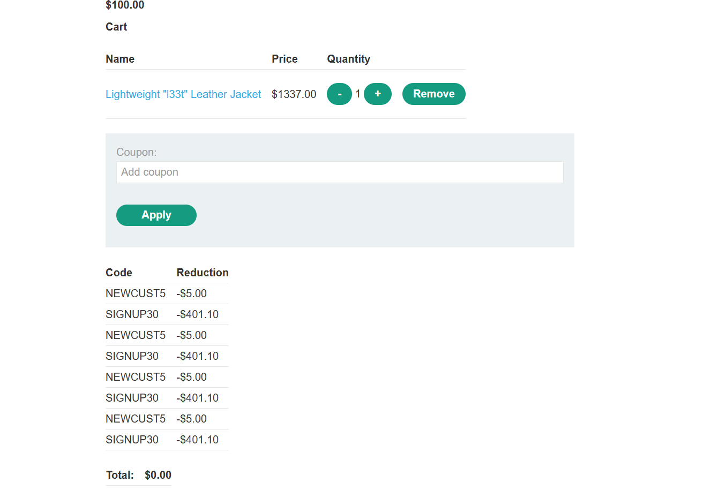


### 5. Nedovoljna provera toka
(_Lab: Insufficient workflow validation_)

Zadatak je da kupimo jaknu ako znamo da redosled akcija pri kupovini predstavlja manu u sistemu. Da bismo videli šta se dešava kada se transakcija uspešno obavi i da bismo se upoznali sa procesom, prvo se prijavimo na sistem i kupimo nešto što možemo da priuštimo. Prateći zahteve vidimo da originalni POST zahtev koji se šalje kad se potvrdi kupovina, vraća 302 - zahtev koji preusmerava na GET koji se šalje da potvrdi kupovinu. 

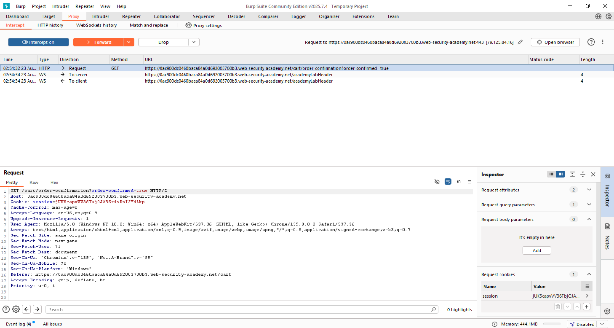

Taj zahtev nema u sebi informaciju o tome šta se u korpi nalazi i da li su sredstva prebačena i možemo da zaključimo da će isto izgledati za bilo koji sadržaj korpe. Zbog toga ga šaljemo u _Burp Repeater_ za kasniju upotrebu.

Dodajemo jaknu u korpu.

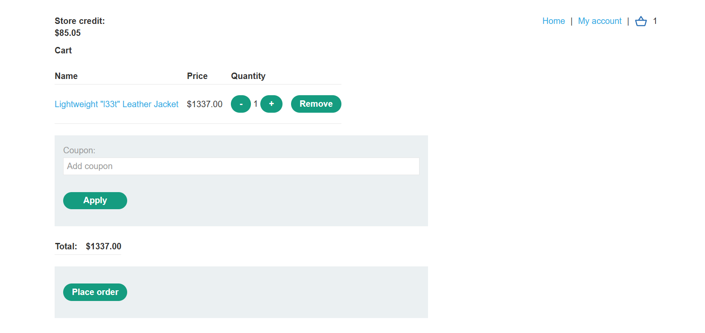

Bez potvrđivanja porudžbine, ponovo šaljemo snimljeni GET zahtev za potvrdu kupovine i tako prevarimo sistem da je jakna plaćena iako se to nije desilo.

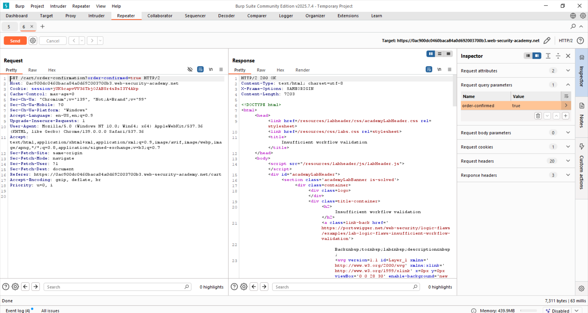
