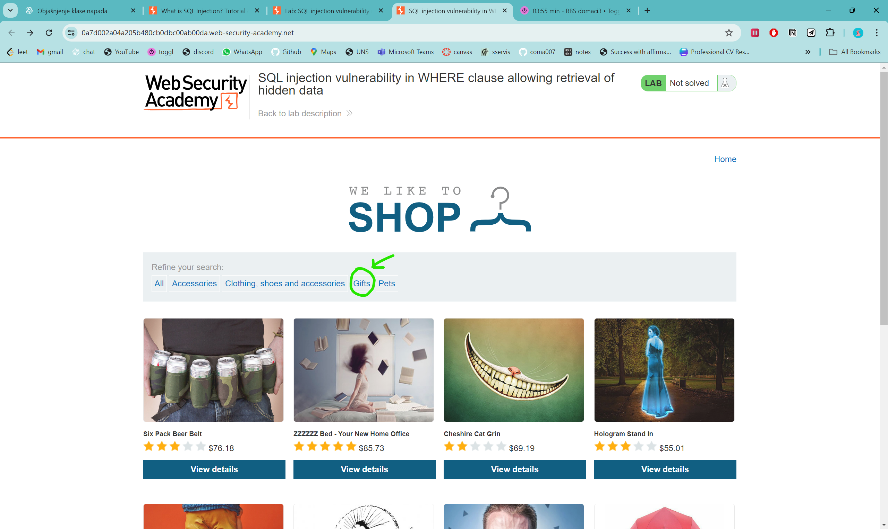

# Attacks and defenses on Web Applications

## **SQL Injection (SQLi)**

Attacker uses unprotected queries that the web app uses to comunicate to it’s database. It can happend when the frontend is not checking user inputs and backend is not validating upon receiving instead it assumes it’s safe. This way the attacker can retrieve information that is private or from other users. They can also modify things and delete them. Denial of servace can also be done with SQL injection.

### **Attack class description**

SQL injection is a web security vulnerability that allows an attacker to interfere with the queries that the app sends to it’s database. This allows the attacker to retrieve data he is not allowed to see, he can also modify and delete data. SQL injection can even escalate to compromise the server or some other backend infrastructure, it can also be used for a DOS (denial of service) attack.

### **Result of exploiting vulnerabilities**

The result is unauthorized access to sensitive data like passwords, credit card details and other private user information. 

### **How do detect these vulnerabilities?**

There is a systematic set of test for detecting them. You can test each entry point in the app by submiting:

- singe quote character ‘ and look for errors or other differences in site bahaviour
- SQL syntax and see whether the site beahaviour changes or stays the same, by that you can tell whether your input is being processed as plain text or SQL executable
- boolean conditions such as “OR 1=1”, and look for changes in response
- payloads that trigger time delays when executed within SQL query, and see if it takes longer to respond
- OAST payloads designed to trigger out-of-band network interaction when executed within SQL query, and monitor resulting response

### **How to prevent SQL injection?**

We can prevent SQL injection by using parameterized queries from our backend to the database instead of using string concatenation within the query, because that concatenation is the way potentialy malicious stuff gets into the backend and through to the database.

For example this code is vulnerable to SQLi because user input is directly concatenated into the query:

```java
String q = "SELECT * FROM products WHERE category = '" + input + "'";
Statement s = connection.createStatement();
ResultSet rs = s.executeQuery(q);
```

We can rewrite it like this, so the user input can’t interfere with the query structure.

```java
PreparedStatement s = connection.prepareStatement("SELECT * FROM products WHERE category = ?");
s.setString(1, input);
ResultSet rs = s.executeQuery();
```

Parameterized queries can be used for situations where user input appears in WHERE clause, and as values in the INSERT or UPDATE statement. It can’t be used for untrusted input in table or column names, or the ORDER BY clause. Apps that place untrusted data into these parts need to use a different approach such as:

- whitelisting permitted input values
- using different logic to provide the required behaviour

For parameterized query to be effective we must always keep the query structure skeleton hard coded, that is this part:

```java
PreparedStatement s = connection.prepareStatement("SELECT * FROM products WHERE category = ?");
```

Never be tempted to decide case-by-case whether data item is trusted. It’s easy to make a mistake about data origin, and changes in other code that could taint trusted data.

### **SQL injection in different parts of the query**

Most SQL injection vulnerabilities happend within the WHERE clause of a SELECT query. However, they can occur at any location in the query, and within different query types.

- In `UPDATE` statements, within the updated values or the `WHERE` clause.
- In `INSERT` statements, within the inserted values.
- In `SELECT` statements, within the table or column name.
- In `SELECT` statements, within the `ORDER BY` clause.

SQL injection examples

- Retrieving hidden data
- Subverting application logic
- UNION attacks
- Blind SQL injection

### Lab 1 - SQL injection vulnerability in WHERE clause allowing retrieval of hidden data

Goal: display one or more UNreleased problems.

We are told that the app uses this query:
SELECT * FROM products WHERE category = 'Gifts' AND released = 1

First we click on Gifts filter.



We can see which items are in that category. Our goal is to see unreleased items too.


All we have to do is insert a ‘ in order to close the ‘Gifts’ string in the SQL query, then add an expression that always evaluates to True like “1=1” and when we OR that it will always give True.


So that will then show us unreleased products too.


### Lab 2 - SQL injection vulnerability allowing login bypass

Goal:  log in as the administrator without knowing the password

We were told that this statement is use for login:
SELECT * FROM users WHERE username = 'wiener' AND password = 'bluecheese’

So all we have to do is comment out everything after username = ‘administrator’ and we will remove the password check. We do this by adding ‘— to the URL.

We first go to profile page by clicking My account link.


Then we type in administrator’— . And anything as the password just so it passes frontend validation.


And we logged in as the admin without knowing the password.


### **Determining the number of columns**

1. By injecting a series of ORDER BY clauses and incrementing the specified column index until an error occurs.
    
    
    
    Once you exeed the number of columns returned by the query the system will throw an error or return no results at all. As long as the behaviour of the site changes you know you exceeded it.
    
2. By submitting a series of UNION SELECT payloads specifying a different number of null values.


If the number of values does not match the query result’s number of columns then the system will throw an error.

We use NULL because we don’t know the column types and NULL can be converted to any type.

### Lab 3 - SQL injection UNION attack, determining the number of columns returned by the query

Goal: figure out the number of columns that product category filter is returning.


First we click on one of the filters, for example Gifts.


Then we try to guess the number of columns that the response has. We use NULL because any type can be of value NULL. And we have to match the type of the response so the surest way to do it is with NULL.


For one NULL we got an error, so we try with two NULLs.


That didn’t work either so we tried with three NULLs.


That worked so now we know that the response has three columns.

### Lab 4 - SQL injection UNION attack, finding a column containing text

Goal: find out which of the result columns is a text column, because data you want to retrieve is usually in text form (like password).

We use the method from the previous lab to find that the number of return columns here is three.

We first try sending the string they gave us, in my case NHRAKK in the first column.


I got an error, so the first column is not a string column. So I try for the second column.


It worked, the app returned our text, so we found the text column.

### Lab 5 - SQL injection UNION attack, retrieving data from other tables

Goal: use SQL injection to retrieve all usernames and passwords, and then use info to log in as the admin

We use the methods shown in the previous labs, to find out the number of columns and which one is  string so we can get username and password trough it.

The response has 2 columns, and the first column is string type.


When you scroll down you will see that it also returned ‘a’  at the end of the list.

(I chose ‘a’, it can be any text)


Now let’s get username and password trough this first column.

We are told that the database contains a table users, with columns username and password.


Note: we use || for string concatenation and put ‘-’ to in between in order to know where username ends and password begins.


We got usernames and passwords of all the users, now we use admin’s username and password to log in as him.

First we click ‘My account’ link.


We fill in the login fields.


We are now logged in as admin.

## Cross-site scripting (XSS)

### **Attack class description**

XSS is a vulnerability where a website accidently let’s the attacker run their JavaScript code insite of your browser as if it came from the website itself. The attacker can then present himself as the victim user, and view private details of that user as well as perform actions that the user can. It is especially dangerous if the user has some sort of priviledged access to the app (like admin), in that case the attacker might be able to completely take control of the application.

It happends when the site doesn’t check and “escape” user input, then if the user input is valid JS code it will run in the browsers of anyone who uses the site afterwards. It can be submitted trough any vulnerable field, forms, comments, etc.

Three common types of XSS

- Reflected XSS: JS script is in a link, when users click, it reflects it into the page
- Stored XSS: malicous JS script is saved on the site (eg. in a comment) and it hits every viewer
- DOM-based XSS: the page’s JS inserts untrusted data into the page in an unsafe way

### Result of exploiting vulnerabilities

By inserting his JS script inside a website that the victim users trust, the attacker can steal they identity by stealing their cookies, or hijacking the session. The purpose of this might be to view private information about the user, do malicious things while impersonating the user, modify and delete data. The attacker can inject a script that changes the content of the website. He can perform phishing attacks by displaying fake login forms or messages. He can inject scripts that download malware to users’ device.  They can also exploit browser vulnerabilities for further attacks.

### How to detect these vulnerabilities?

Easiest way to do this is to let Burp Suite Scanner try lots of XSS tests for you automatically.

Manually this is done by inputing some unique marker text like (like “banana123man”) into every input, and then see where it comes back through the site. Then figure out in which context the marker is, it can be HTML text node in between tags, it can be a quoted or unquoted HTML attribute, it can be inside a JS string, inside a URL attribute or CSS context.

- HTML text node (between tags)
    - Example finding: <p>Hello banana123man</p>
    - Test payload: </p>
- HTML attribute (quoted or unquoted, incl. href/src)
    - Example finding:  or <a href="/q?=banana123man">
    - Test payloads:
        - Quoted attr: ">
        - Unquoted attr: onmouseover=alert(1) a=
        - URL attr: try breaking out as above; if allowed, test javascript:alert(1) (often blocked by modern defenses, but good to check)
- JavaScript string (inside <script>...</script> or event handlers)
    - Example finding: <script>var q="banana123man";</script>
    - Test payload: ";alert(1);// (for double quotes) or ';alert(1);// (single quotes)
- DOM-based sinks (client-side insertion like innerHTML, insertAdjacentHTML)
    - How to spot: put banana123man in the URL param, then in DevTools search after load; if JS puts it into the DOM via a risky sink, test with:
    - Test payload: ">

### How to prevent XSS attacks?

- Filter user input on arrival. Filter as strictly as possible based on what is expected.
- Encode data on output. Before you put any user-provided text into you site HTML code, transform special characters so the browser treats it as plain text and not code.
- Use appropriate response headers. Label every response with correct Content-Type, tell the browser to not to guess what response type is by sending X-Content-Type-Options: nosniff.
- Use Content Security Policy. Use this as the last line of defense to reduce the severity of any XSS vulnerabilities that still occur. The policy tells the browser what’s allowed to run or load on your page (scripts, styles, images, etc.) . If an attacker injects JS code, the browser will check with policy rules and refuse to run anything that is not on the allow-list.

### Lab 1 - **Reflected XSS into HTML context with nothing encoded**

Goal: Perform XSS attack that calls alert function

We are told the vulnerability is in search functionality.


Search for “banana123man”.


The marker is inside a h1 tag as text.

This means we can close the tag and add a script tag with alert function in it.


And the alert appeard.

### Lab 2 - **Stored XSS into HTML context with nothing encoded**

Goal: submit a comment that calls the alert function when the blog post is viewed

We are told that there is a vulnerability in comment functionality.

When we open the tab we go into any post, and scroll down to the comment section enter our marker


We can see that our marker ends up in a p tag, so all we have to do is close the p tag and add a script tag with alert function inside it.


After posting this comment, and once again clicking “<Back to blog” link we can see our alert.


### Lab 3 - **Reflected XSS into a JavaScript string with single quote and backslash escaped**

Goal: perform XSS attack to break out of JS string and call alert function

We are told that there is a vulnerability in the search query tracking functionality. Also we are told that singe quotes ‘ and backslashes \ are escaped, so we won’t be able to use them to break out and use alert.


We type in our marker text and click search.


Here we can  see how our marker text is in a JS string.

We can first try and see what happends when we try to break it using ‘. We enter: ‘; alert()


But the **‘** get’s escaped ****using a backslesh **\’**.

So now we can try and escape that backlash with our own by entering \’; alert()


Our backslash also get’s escaped. So that’s what the title of the lab esentially told us.

We should be able to break out by closing the script tag and opening a new one. Because the opening bracked is not listed in the lab as something that is escaped.

I enter: </script><script>alert(’banana’)</script>


That worked because the < wasn’t escaped.


### Lab 4 - **Reflected XSS into a JavaScript string with angle brackets and double quotes HTML-encoded and single quotes escaped**

Goal: perform XSS attack that breaks out of JS string and calls the alert function

We are told that angle brackets and double quotes are HTML-encoded and single quotes are escaped.

So we have to find a different way to break the string, one thing that is not mentioned as blocked is backslash, so we can use ‘ combined with \, like this \’ so when they add a backslash to escape our ‘ we get \\’ which means the backslash itself gets escaped and the single quote is not.

So first we enter some marker text and click search.


We can see our text is in a JS string with single quotes.

Now we enter banana123man\’; alert();


This manages to close the string out. But because we still have that one closing ‘ left without being able to enter another ‘ to pair it, the JS is considered invalid and doesn’t execute at all. So alert doesn’t get called.


The easiest way to handle this is to just comment out the rest of the code after the alert().

So we enter: banana123man\’; alert() // 


The alert shows.

### Lab 5 - **Reflected XSS with some SVG markup allowed**

Goal: perform XSS attack that calls alert() function

We are told the site blocks common tags, but misses some SVG tags and events.

So they already told us to use the svg tag, but in case we wanted to see which tags/events can pass we can use Burp Suite to test all tags and events for us and see which ones return response 200 meaning they were not forbiden.

First we open Burp Suite, go to the “Target” tab and click on the “Open Browser” button. That opens a Chrome browser. Then we copy the link to the lab into the broser.


We search for anything, just to be able to see the search GET request in the Target tab of Burp Suite.

Here we can see our request:


Now we right click on the request and choose “Send  to Intruder” option. Then we click on the Intruder tab.

Here we can see where our payload marker is:


Here we can iterate through different payloads.

First we delete our marker, in my case it’s: “banana123man”. 

And instead add this symbol  § by clicking on “Add §” button.


After we click on add, the symbol is added and a Payload side panel pops up. That is where we enter a list of tags that Burp Suite will brute force for us.

We got to the [XSS cheat sheet](https://portswigger.net/web-security/cross-site-scripting/cheat-sheet)  page. And copy the list of HTML tags.


Then we just paste it into Burp Suite Payloads window.


After pasting we click on the Start Attack button and look for which of the tags gave request status 200, meaning it’s not forbidden.


Here we can see that animetransform, image, svg and title are not blocked.

To solve out lab we can use svg and animatetransform tag.

But we will need something to launch our attack in the form of an event listener. So in the same way we tried all the tags, now we try all the events, which are also available on the  [XSS cheat sheet](https://portswigger.net/web-security/cross-site-scripting/cheat-sheet) .


We paste that in as the payload and since we know we can use svg and animatetransform we put the § symbol in place of the event. And then we start the attack to see which events will not be blocked.


Note make sure to use %20 instead of a space between animateTransform tag and its’ event attribute, like in the image above.


Okay so the only event that doesn’t get blocked is onbegin which will work for us because animateTransform is a tag that does some animation on svg, so it has onbegin event, that specifies code that executes at the beginning of the animation.

So now we make it call alert() before the animation begins like this.


And we get the alert.