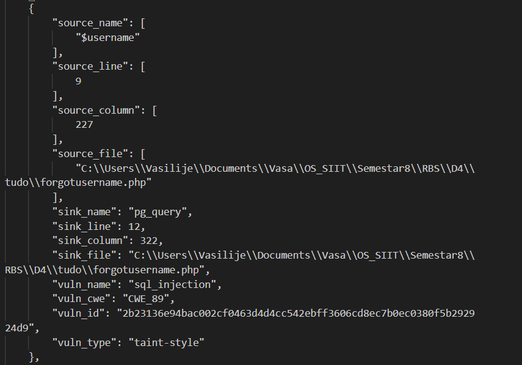
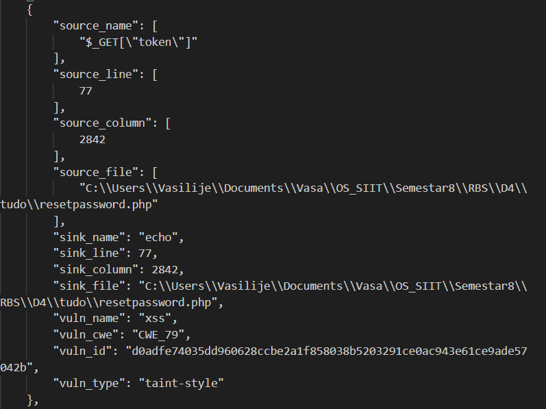

# Zadatak 1 - Zaobilaženje login-a

## Uvod

Kao deo zadatka analizirana je aplikacija **TUDO**, koja je namerno ranjiva. Za detekciju ranjivosti korišćen je alat **ProgPilot**, a zatim je razvijen *Python* skript koji demonstrira iskorišćavanje SQL injection propusta i omogućava zaobilaženje autentikacije.

ProgPilot je prijavio dve ključne ranjivosti:

- SQL injection u `forgotusername.php`

- Reflected XSS u `resetpassword.php`

## Opis *script*-a

*Script* je napisan u *Python*-u i koristi biblioteku *requests* za komunikaciju sa aplikacijom.

### Određivanje dužine korisničkog imena
Funkcija `get_username_length()` koristi blind *SQL injection* na `forgotusername.php` kako bi pronašla tačnu dužinu korisničkog imena u bazi. Koristi sledeći string koji se injektuje u upit.

`' OR username=(SELECT username FROM users WHERE LENGTH(username)=i ORDER BY username DESC LIMIT 1) --`

Dok brojač trči kroz sve vrednosti `i` od 1 do proizvoljne maksimalne dužine, dužina je pogođena kada aplikacija vrati poruku da korisnik postoji. `ORDER BY username DESC` osigurava da kod neće vratiti admina, već redovnog korisnika.

### Rekonstrukcija korisničkog imena
Funkcija `get_username()` zatim otkriva korisničko ime karakter po karakter, poredeći prefiks sa onim u bazi:

`' OR username=(SELECT username FROM users WHERE LENGTH(username)=length ORDER BY username DESC LIMIT 1) AND username LIKE 'prefix%' --`

### Dobijanje reset tokena
Funkcija `get_token()` koristi sličan pristup da bi karakter po karakter rekonstruisala reset token iz tabele tokens.

`{username}' AND (SELECT token FROM users u, tokens t WHERE u.username='{username}' AND u.uid=t.uid ORDER BY t.token DESC LIMIT 1) LIKE '{partial_token}%' --`

### Reset lozinke
Kada se pronađu korisničko ime i token, funkcija `reset_password()` šalje zahtev ka endpointu `resetpassword.php` i postavlja novu lozinku. Novu lozinku je moguće konfigurisati po želji u fajlu *values.json*.

### Login
Na kraju, skript koristi `requests.Session()` da bi se ulogovao sa poznatim kredencijalima i dobio validan *session cookie*.

## Analiza korišćenja ProgPilot nalaza

*SQL injection* u `forgotusername.php`: Ova ranjivost je iskorišćena direktno da se enumeriše korisničko ime i reset token.

*XSS* u `resetpassword.php`: Iako direktno nije iskorišćen u *script*-u, ProgPilot nalaz ukazuje da je token ubačen u *HTML* bez sanitizacije pomoću `echo $_GET['token']`. To znači da bi napadač mogao konstruisati maliciozan link i ukrasti sesiju korisnika preko brauzera.  
U kontekstu zadatka, nama je prvenstveno pomogao uvid u mehanizam kako se token prenosi kroz aplikaciju i mogućnost manipulacije njime preko `GET` parametra.
