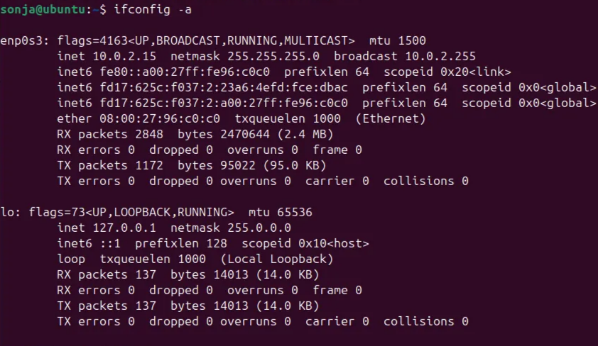
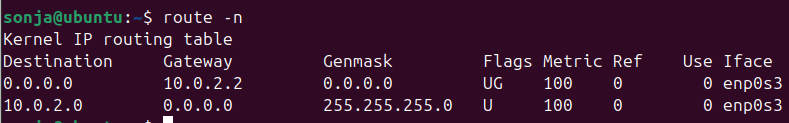
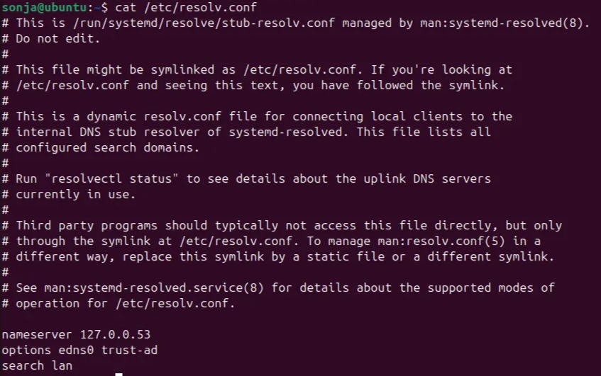
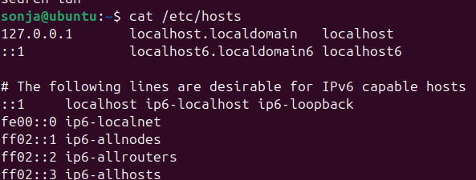
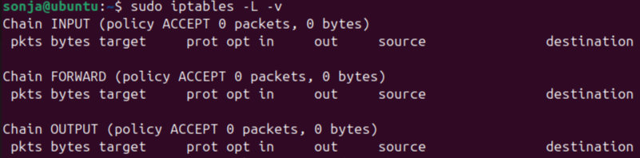
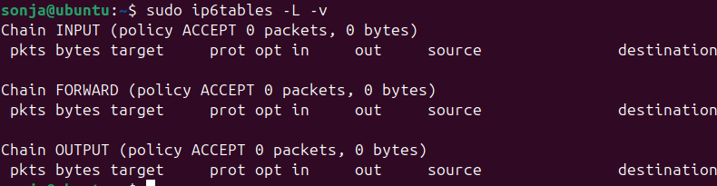
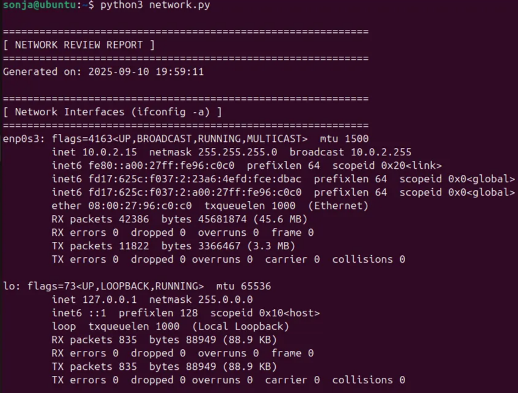
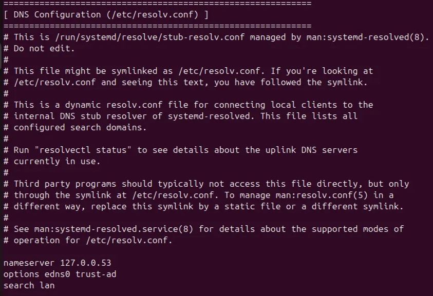
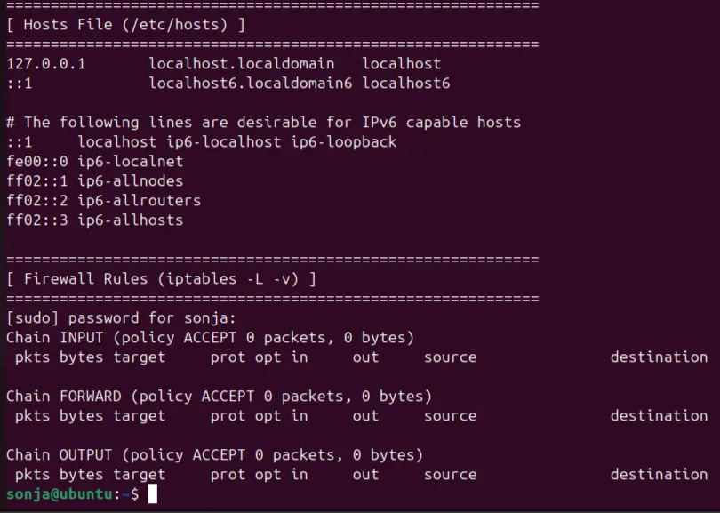

# Network Review

Ovaj izveštaj se vezuje za pregled mreže i firewall-a na Linuks sistemu. Prikazan je neposredan rad u terminalu, koji smo kasnije objedinili u python skriptu.



Pregled mrežnih interfejsa pokazuje da server koristi privatnu mrežu (IPv4 adresu 10.0.2.15 i više IPv6 adresa) i loopback (localhost) mrežu (sa IPv4 i IPv6). 



Routing tabela pokazuje default gateway 10.0.2.2 preko interfejsa enp0s3, što omogućava serveru izlazak na internet. Takođe je prisutna ruta za lokalnu mrežu 10.0.2.0/24. 



Pregled datoteke `/etc/resolv.conf` pokazuje da sistem koristi lokalni stub resolver (127.0.0.53) preko systemd-resolved. Opcija `trust-ad` omogućava DNSSEC validaciju, što je pozitivno sa aspekta bezbednosti. Međutim, preporuka je da se DNS serveri ručno postave na pouzdane izvore (npr. 8.8.8.8, 1.1.1.1) kako bi se smanjio rizik od DNS spoofing napada u nesigurnim mrežnim okruženjima.



Datoteka `/etc/hosts` sadrži samo podrazumevane unose za IPv4 i IPv6 loopback adrese (localhost). Nema prilagođenih unosa koji bi mogli da dovedu do pogrešnog razrešavanja DNS imena. Konfiguracija je bezbedna.



Pregled `iptables` pravila pokazuje da server trenutno nema podešen firewall – sve ulazne, izlazne i forward-ovane konekcije su prihvaćene. Ovo značajno povećava rizik u slučaju napada. 

Preporuka je da se postavi politika ‘default deny’ (DROP) za ulazni saobraćaj i eksplicitno dozvole samo servisi koji su potrebni (SSH za administraciju, HTTP/HTTPS za web aplikaciju). 

Takođe, treba ograničiti odlazni saobraćaj ka internetu (osim DNS, NTP i update servera)  kako bi se smanjio rizik od zloupotrebe u slučaju upada.

Pravimo fajl iptables.up.rules:

```bash
# cat /etc/iptables.up.rules                   
*filter 
:INPUT DROP [0:0] 
:FORWARD ACCEPT [0:0] 
:OUTPUT ACCEPT [27:3016] 
-A INPUT -i lo -j ACCEPT  
-A INPUT -i eth0 -p tcp -m tcp --dport 22 -j ACCEPT  
-A INPUT -i eth0 -p tcp -m tcp --dport 80 -j ACCEPT  
-A INPUT -m state --state RELATED,ESTABLISHED -j ACCEPT 
COMMIT
```



Takođe nisu postavljena pravila ni za IPv6,  možemo postaviti ista pravila kao i za IPv4 ili da ga onemogućimo.

## Results





