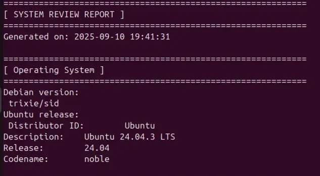
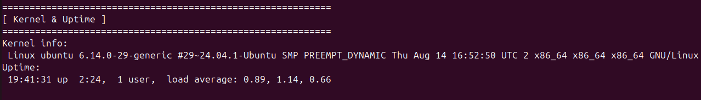
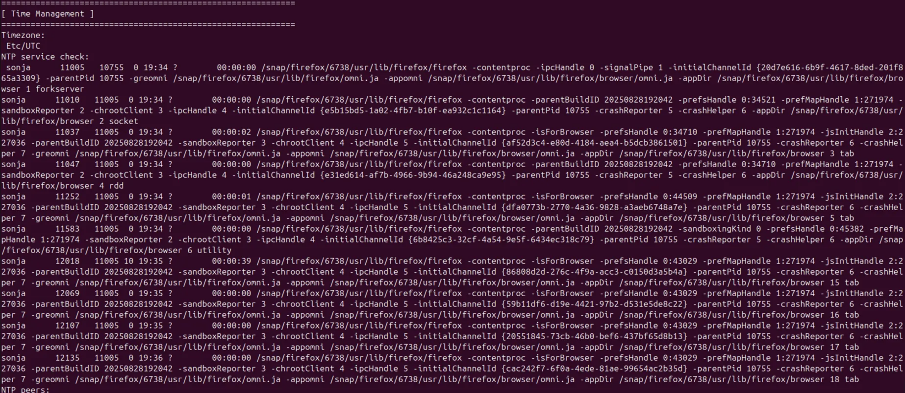
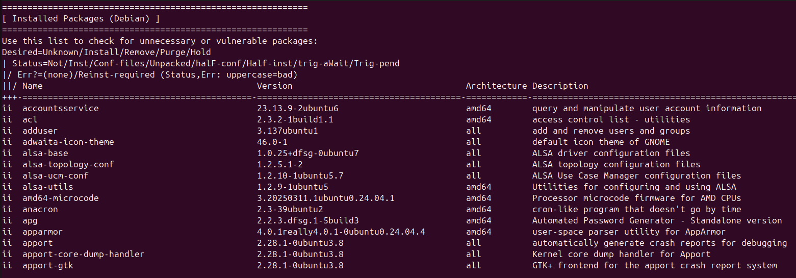
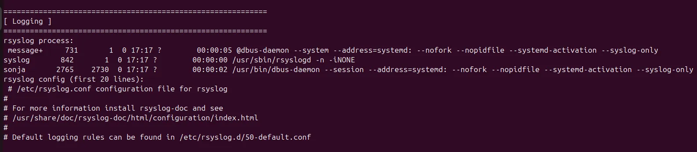
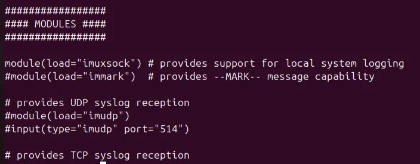
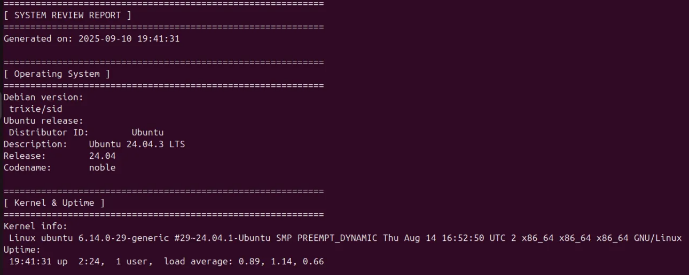
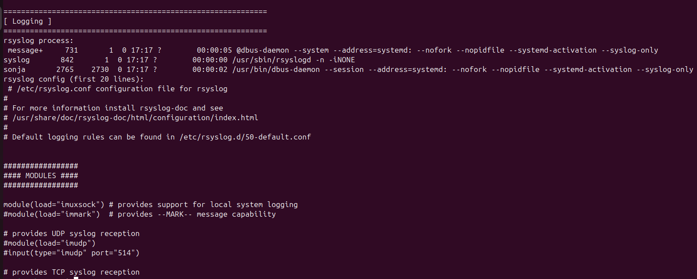

# System Review

Ovaj izveštaj se odnosi na pregled korisnika i njihovih privilegija na Linux sistemu. Podaci su prikupljeni pomoću Python skripte koja čita informacije direktno iz operativnog sistema. Cilj je da se proveri da li postoje nepotrebni ili sumnjivi nalozi, da li su privilegije pravilno podešene i da li postoje potencijalni bezbednosni rizici.

Provera operativnog sistema pokazuje da server koristi Ubuntu 24.04.3 LTS (codename noble), koji je zasnovan na Debianu. Debian verzija je označena kao trixie/sid, što ukazuje na unstable/testing granu. LTS izdanja su generalno pogodna za produkciju jer imaju redovnu sigurnosnu podršku, dok unstable grane predstavljaju rizik zbog mogućih nestabilnih paketa. Preporuka je korišćenje isključivo LTS repozitorijuma na produkcionim serverima.

Kernel je verzije 6.14.0-29-generic (Ubuntu 24.04 build). Kernel je relativno nov, ali je potrebno redovno proveravati sigurnosne zakrpe jer ranjivosti u kernelu često omogućavaju eskalaciju privilegija. Uptime servera je 2 sata i 24 minuta, što znači da je sistem nedavno restartovan. Opterećenje (load average) je nisko i u skladu sa očekivanjima, što ukazuje na stabilan rad servera.

Server koristi UTC vremensku zonu, što je preporučeno za produkcione sisteme. Međutim, provera NTP servisa nije pokazala aktivan servis za sinhronizaciju vremena. To znači da server trenutno ne usklađuje sat sa pouzdanim izvorom, što može dovesti do problema sa logovima, sertifikatima i autentikacijom. Preporuka je da se aktivira `systemd-timesyncd` ili `ntpd` kako bi se obezbedila tačna sinhronizacija vremena.

Lista instaliranih paketa pokazuje prisustvo nekoliko paketa koji su nepotrebni na serverskom okruženju: `adwaita-icon-theme`, `alsa-*` audio drajveri, i `apport-*` (alatke za crash report, uključujući GUI komponentu). Ovi paketi povećavaju površinu napada i trebalo bi ih ukloniti. Kritični bezbednosni paketi poput `apparmor` i `amd64-microcode` su ispravno instalirani i treba ih zadržati. Preporuka je redovno ažuriranje (`apt list --upgradable`) kako bi se izbegle poznate ranjivosti.

Na serveru je pokrenut `rsyslog` servis i koristi se standardna konfiguracija (`/etc/rsyslog.conf` i `/etc/rsyslog.d/50-default.conf`). To znači da se logovi beleže lokalno, što je ispravno, ali predstavlja rizik jer napadač može obrisati lokalne fajlove. Preporuka je da se logovi šalju i na udaljeni log server, kako bi se očuvali čak i u slučaju napada na sistem.

Konfiguracija rsyslog servisa pokazuje da se koristi modul `imuxsock` za lokalno logovanje, dok su moduli za mrežni prijem (`imudp` i `imtcp`) zakomentarisani. To znači da server beleži samo lokalne logove i ne radi kao centralni log server. Preporuka je da se logovi dodatno šalju na udaljeni syslog server (`*.* @@ip-adresa:514`) kako bi se sprečilo njihovo brisanje u slučaju kompromitacije sistema.

## Results

