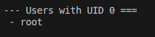
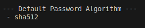
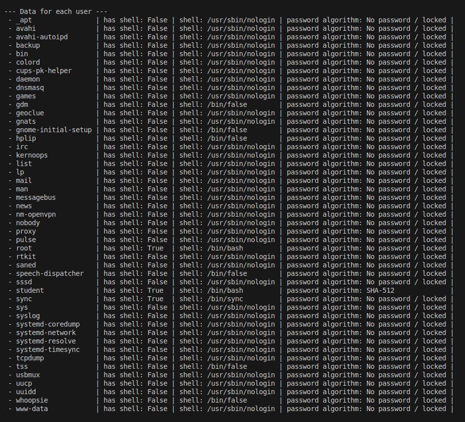
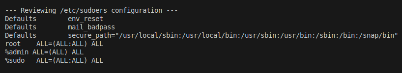

# Pregled korisnikâ u sistemu

Ovaj izveštaj se vezuje za pregled korisnika i njihovih privilegija na Linuks sistemu. Podaci izloženi u izveštaju prikupljeni su *python script*-om koji pristupa podacima na operativnom sistemu.

---

## 1. Pregled fajla *passwd*

Fajl `/etc/passwd` sadrži osnovne informacije o svim korisnicima na sistemu: njihova imena, UID, GID, *home* direktorijume i *shell*.  
Prilikom pregleda fokus je bio na dve ključne stavke:

1. **UID 0 korisnici**  
   - Na Linuks sistemima samo *root* korisnik treba da ima UID 0.  
   - Ako bilo koji drugi korisnik ima UID 0, on efektivno ima *root* privilegije, što predstavlja ozbiljnu bezbednosnu rupu.
   - U posmatranom sistemu, među UID 0 korisnicima nađen je samo *root*.  
   

2. **Pristup shell-u**  
   - Korisnici koji imaju *login shell* (npr. `/bin/bash`) mogu da se prijave i izvršavaju komande na sistemu.  
   - Korisnici čija je vrednost shell-a `/usr/sbin/nologin` ili `/bin/false` ne mogu da se prijave, što je preporučeno za sistemske i servisne naloge.  
   - U poglavlju **3. Podaci o svim korisnicima** je izlistano koji korisnici imaju *shell*.

---

## 2. Pregled fajla *shadow*

Fajl `/etc/shadow` čuva informacije o lozinkama korisnika. On je dostupan samo *root*-u, pa je za pregled bilo potrebno pokrenuti program sa povišenim privilegijama:

    sudo python3 users_review.py

Analizirane su sledeće stavke:

1. **Podrazumevani algoritam za lozinku**  
   - Utvrđeno je da sistem koristi SHA-512 kao podrazumevani algoritam za heširanje lozinki. Ovaj algoritam trenutno predstavlja najbezbedniju dostupnu opciju u modernim Linuks distribucijama i preporučuje se za upotrebu.  
   

2. **Algoritam za svakog korisnika**  
   - Analiziranjem heš-polja iz fajla *shadow* ustanovljeno je koji korisnik koristi koji algoritam, odnosno koji korisnici ni nemaju lozinku.
   - U poglavlju **3. Podaci o svim korisnicima** je izlistano koji korisnici koriste koji heš-algoritam. 

---

## 3. Podaci o svakom korisniku

Za svakog korisnika je izlistano ime, *shell* i algoritam za heširanje lozinke.

Primetimo da jedino korisnici *root*, *student* i *sync* imaju *shell*, dok je ostalima onemogućena interaktivna prijava. Korisnik *sync* ima interaktivni *shell* koji se koristi za administratorske svrhe i retko je potreban.  

Korisnik *student* je jedini sa lozinkom koja se hešira algoritmom SHA-512, koji je ustanovljen i kao podrazumevani. Ostali korisnici nemaju lozinku ili je zaključana, odnosno heš-polje im je `*` ili `!`.

---

## 4. Pregled fajla *sudoers*

Fajl `/etc/sudoers` definiše ko ima pravo da koristi komandu `sudo` i pod kojim uslovima. Primer sa testiranog sistema je dao sledeći prikaz:

**Analiza:**

- `Defaults env_reset` – resetuje okruženje kada se koristi `sudo`, čime se smanjuje rizik od zloupotrebe environment promenljivih.  
- `Defaults main_badpass` – beleži pokušaje unošenja pogrešne lozinke.  
- `Defaults secure_path=...` – definiše siguran PATH za korisnike koji koriste `sudo`, čime se izbegava izvršavanje malicioznih programa iz nepouzdanih lokacija.  
- `root ALL=(ALL:ALL) ALL` – root korisnik može izvršiti bilo koju komandu kao bilo koji korisnik ili grupa.  
- `%admin ALL=(ALL) ALL` – članovi grupe `admin` mogu izvršavati sve komande kao bilo koji korisnik (ali bez definisanja grupe).  
- `%sudo ALL=(ALL:ALL) ALL` – članovi grupe `sudo` imaju potpune privilegije, isto kao i root.  

---
