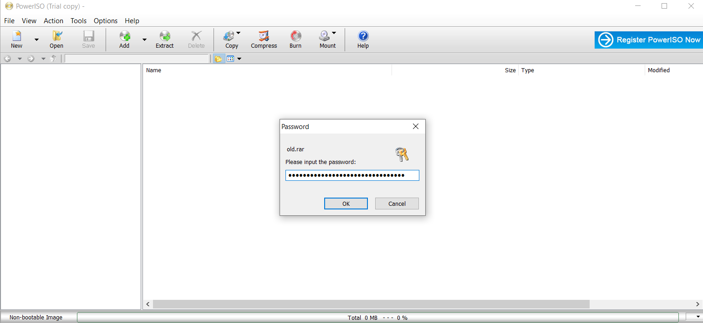

# Zadatak: Zaključana arhiva

Dat je niz pitanja čiji odgovori predstavljaju šifru zaključane arhive.

```
1. Date when Faculty of Technical Sciences officialy opened. (Date Format : DD/MM/YYYY) 

MD5 : 02c3890bb0b03a24b99c3e4a39f18c44
```
Datum otvaranja je bilo lako da se nađe prostom pretragom istorije fakulteta: 18.5.1960.

```
2. First name of the person who held the position of dean at the faculty from 01.10.1975. until September 30, 1977. ? 

MD5 : 06904f68128802c069e782b772e85eda
```
Pretragom: ftn dekan "1975", našla sam izjavu fakulteta (na vikipediji) kad je Dragutin Zelenović preminuo da su rekli da je bio dekan u traženom periodu.

Dragutin

```
3. The date when the FTN website was launched. (Date Format : DD/MM/YYYY) 

MD5 : f4d7caf81e33bc156cc3e98cf8095d2e
```
Proveravala sam veb arhivu https://web.archive.org i nisam našla verziju pre 3.4.2009. Proverom date heširane vrednosti sam ustanovila koji je traženi datum. Probala sam i .yu da bih dobila rezultate pre 2007. jer je tek tada uveden .rs.

18/05/2005


```
4. The year when studies in the field of "Poštanski saobraćaj i telekomunikacije" were introduced. 

MD5 : 5ec829debe54b19a5f78d9a65b900a39
```

Na stranici na vikipediji našla sam:

_Od školske 1999/2000. dolazi promena, kada počinju studije grafičkog inženjerstva i dizajna, poštanskog saobraćaja i telekomunikacija, inženjerskog menadžmenta i inženjerstva zaštite životne sredine. Od školske 2002/2003., kao interdisciplinarni smer, počele su studije mehatronike._

Dakle u pitanju je 1999.

Spajanjem ovih podataka u jedan string (18/05/1960Dragutin18/05/20051999), uspela sam da otključan arhivu.



