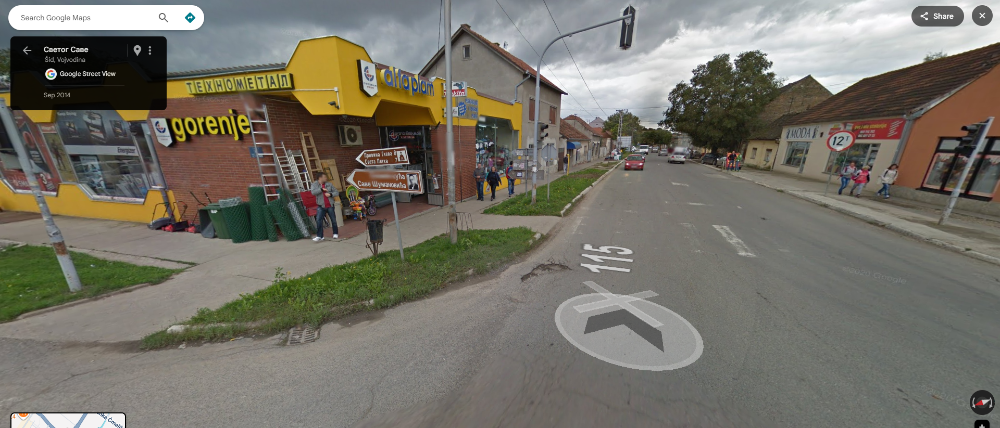
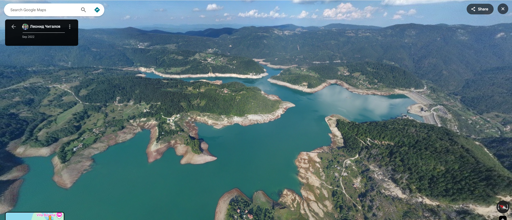

# Zadatak 1

Prikazana je slika s ulice.

Pretraživanjem spomen-kuće Save Šumanovića (na putokazu), nalazimo da je locirana u Šidu. Poredeći gde se ona nalazi u odnosu na manastir Svete Petke koji se lako nađe severno od Šida, tražene mesto je prva raskrsnica južno od spomen-kuće.

Koordinate su **45.1263863,19.2292279**.

# Zadatak 2

Prikazana je slika iz vazduha.

Analiziranjem vegetacije i reljefa okoline, pretpostavili smo da je mesto na našim prostorima. Poredili smo krajolik sa nekim mestima poznatim po vodenim bogatstvima: Đerdap, Tara, Bajina Bašta, Uvac. Pregledom po 3D snimku na Gugl mapama smo ugledali vodenu površinu u sklopu Nacionalnog parka Tara čiji oblik odgovara onom sa slike - Zaovinsko jezero. Ušli smo u sliku snimljenu iz najbližeg ugla onom sa slike.

Koordinate su **43.8704997,19.3853197**.
