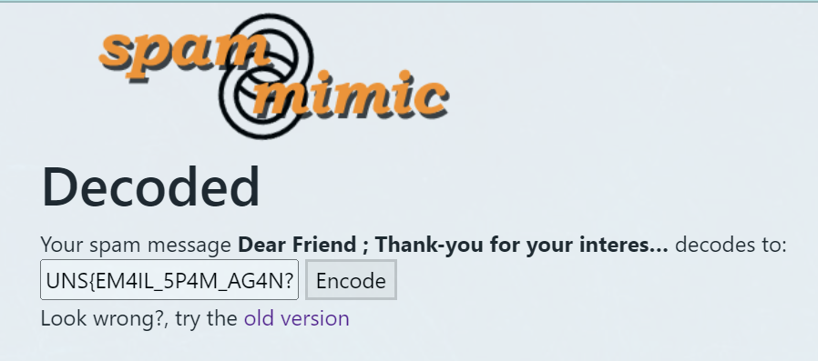

# Nigerian Prince

The challenge is to find out is the email our friend received just spam or does it have any actual meaning.

We first tryed to solve this challange by taking first letter of every line:
D!sim,!iaw!&tbumBhostyc3shliYyaPbBmoo (backward: oomBbPayilhs3cycotshBmubt&!wai,!misD).
Since by itself it didn’t mean anything, we tried to read every other letter and every third letter. 

Every other letter Dsm!a!tuBotcslYabmo (backward: ombaYlsctoBu!a!msD). Also doesn’t mean anything read both forward and backward.

And every third from front: s,!!uht3iYmo, and back: mPihcosua,iD.

I tried google-ing all there strings and asked chatGPT about them ultimately none of these had any meaning.

Then I also tried using some cipher checks like ROT13 and Ceaser shifts (all 25). But the didn’t give me any valid strings back. Neither did the base64, binary and compression checks using some online tools. 

Last thing I tried was using just the numbers that appear in the text and decoding them as ascii characters in various ways. That also did not work.

### Spam

Then I actually read the email and saw that it has repetitive terms and it doesn’t really make sense nor does it ask the user to actually do something, so I tought to find a spam specific tool or a method of encoding/decoding. Then I found SpamMimic and tried decoding the email text, I emidately got the result flag: UNS{EM4IL_5P4M_AG4N?}.

After solving the task, I tried to find the algorithm for encoding/decoding. And it turns out that the email actually can’t be decoded by hand, because the SpamMimic uses a perticular dictionary of spam terms that is not publicly available.

It works somethig like this. Let’s say our flag is: HI.

In binary: H = 01001000 and I = 01001001. So together its: 01001000 01001001.

Then we define a grammar:

MESSAGE → INTRO BODY CLOSE

INTRO → "Dear Friend;"                        (code = 0)
"Dear Internet user;"                              (code = 1)

BODY  → "THIS IS NOT A SCAM."       (code = 00)
"WORK FROM HOME!"                          (code = 01)
"MAKE MONEY FAST"                            (code = 10)
"NO EXPERIENCE NEEDED"                  (code = 11)

CLOSE → "Thank you."                           (code = 0)
"Sincerely,"                                                (code = 1)

Dear Friend; MAKE MONEY FAST WORK FROM HOME! THIS IS NOT A SCAM. THIS IS NOT A SCAM. MAKE MONEY FAST WORK FROM HOME! THIS IS NOT A SCAM. Sincerely,  
Now because our grammar is very simple the message is super repetitive, but that is how it generally works.