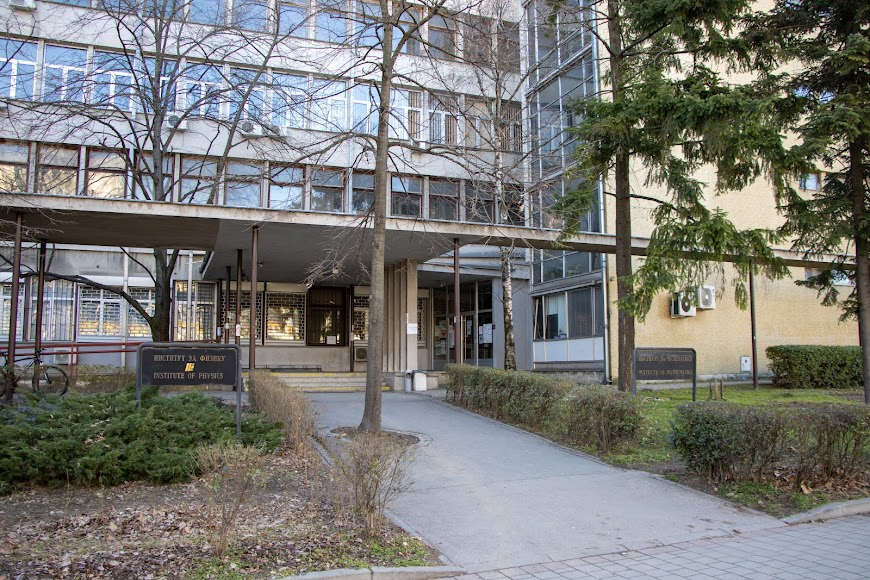
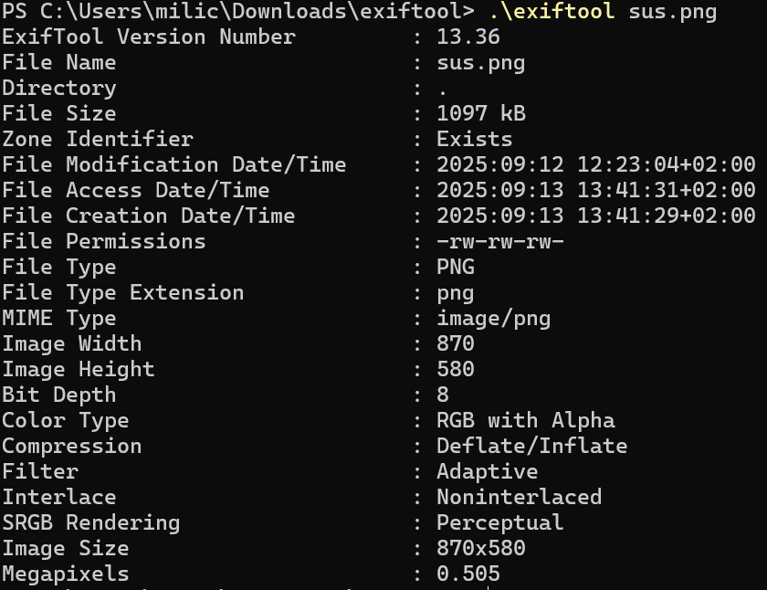
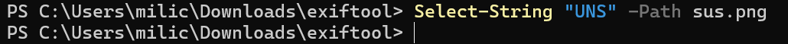
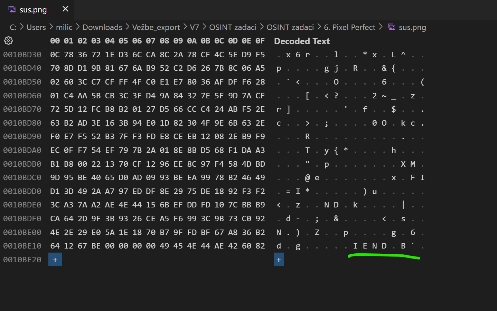
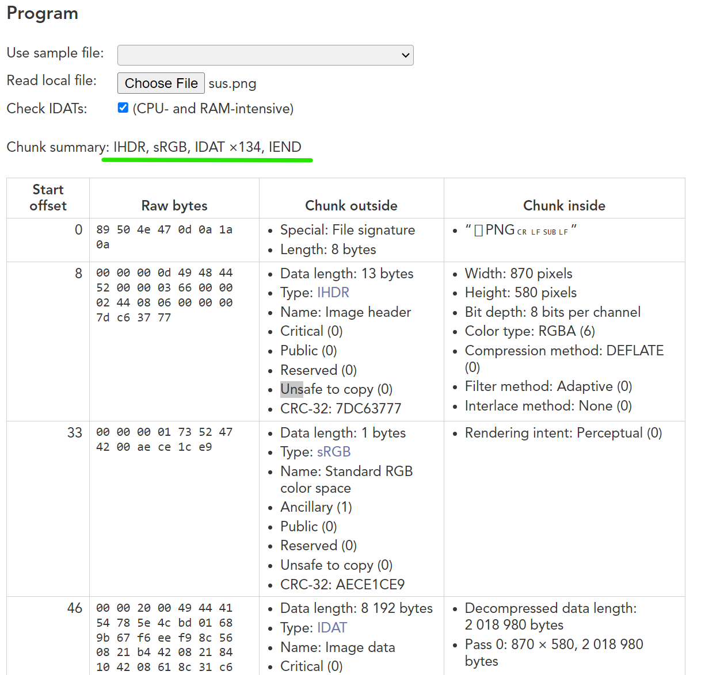
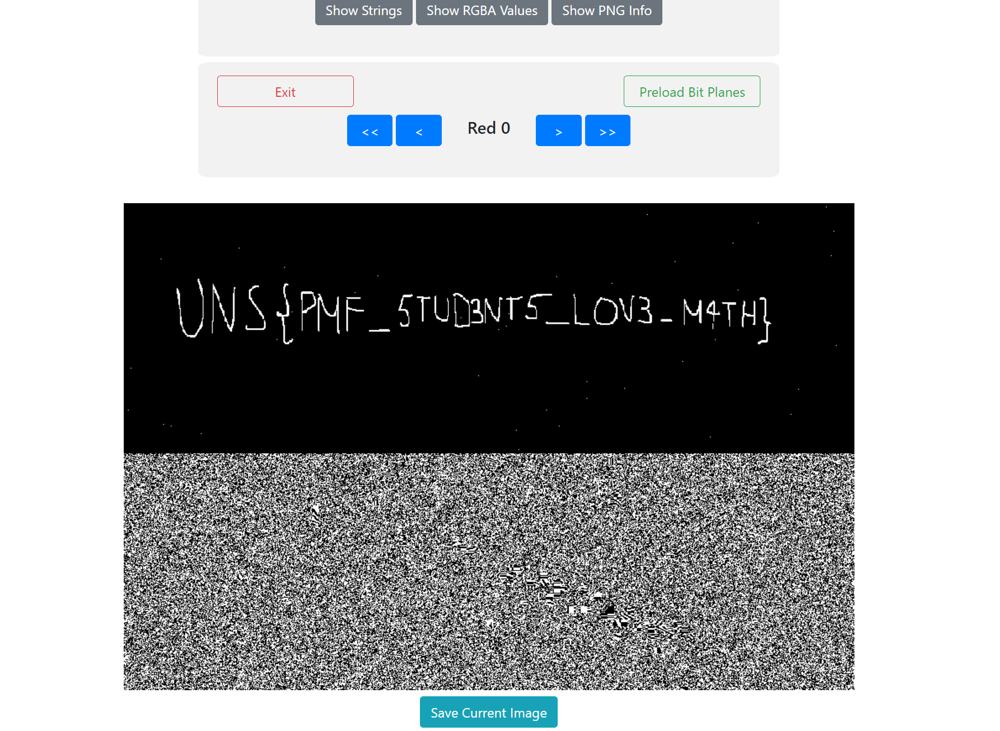

# Pixel Perfect

The challenge is to find out what important thing our mate wanted to tell us,  just by this image he sent us.

I will solve this task using steganography / image forensics, meaning I will use binary information coded within the image.

### Exiftool

At first I tried to inspect the PNG with **exiftool** to look for metadata such as GPS tags, author comments, or custom PNG text chunks. This is what I got:

In this case, the output only showed basic file properties (size, resolution, compression), with no hidden fields or comments. Therefore, I concluded the flag was not hidden in EXIF metadata and moved on to deeper steganalysis.

### Strings search

I searched the binary for any occurrence of the string UNS, which would indicate the flag is directly embedded as ASCII text.

Since this returned nothing, we can see that the flag is not stored in plaintext in the file.

### Hex Editor

I used the VS Code Hex Editor to see if the file has any suspicious data after the IEND marker, but it didn’t.

### Nayuki

I inspected the PNG with Nayuki’s chunk analyzer to look for suspicious tEXt or iTXt chunks that might hold the flag.

There were no tEXt or iTXt chunks with hidden comments, meaning the flag was not stored in plain metadata. This suggested that the flag might instead be encoded within the pixel data, requiring steganography analysis.

### LSB Stenography using GeorgeOm’s StegOnline

Finally, I analyzed the **least significant bits** of the image using StegOnline’s Bit Plane Browser. 

LSB steganography works by hiding information in the least significant bits of pixel values. Changing these bits doesn’t really affect how the picture looks to the human eye, but together they can store a hidden message. 

In this case, the flag was stored in the LSB of the red, green, and blue channels. This confirmed that the flag was stored using LSB steganography in the pixel data. The extracted flag was: **UNS{PMF_STUD3NTS_LOV3_M4TH}**.