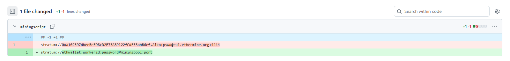
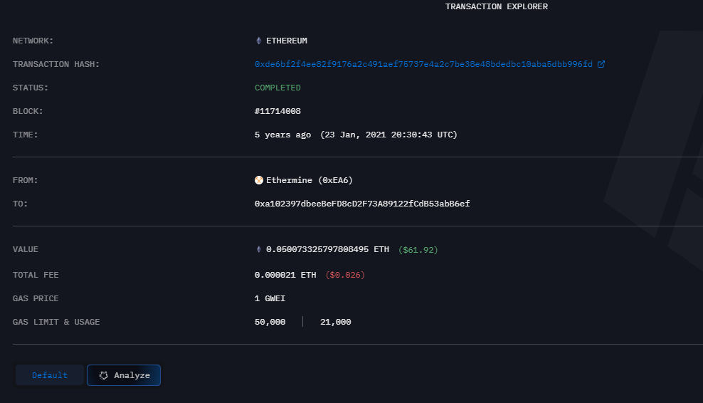
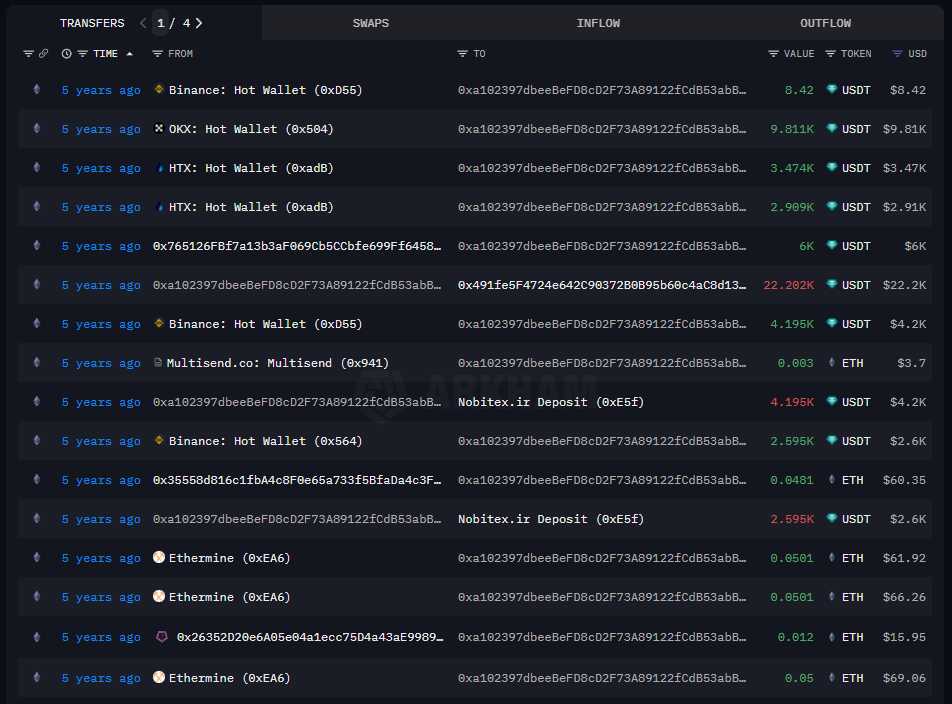

# Sakura

## 1. Početak

U polje za odgovor napisali smo **Let's Go!**

## 2. Korisničko ime

Data je slika.
U developer opcijama našli smo ``g`` taga sa binarnim zapisom, koji smo preveli u tekst. Dobili smo poruku ``A picture is worth 1000 words but metadata is worth far more``, što nas je navelo da pogledamo metapodatke.  
U njima smo putanju do slike na računaru 
``filename="/home/SakuraSnowAngelAiko/Desktop/pwnedletter.png"`` i odgovor je bio korisničko ime **SakuraSnowAngelAiko**.

## 3. Ime, prezime i mejl

Preko Gugla tražili smo ključnu reč ``sakurasnowangelaiko``.
Našli smo tviter nalog i otkrili ime i prezime - **Aiko Abe**.
Našli smo githab nalog sa istim korisničkim imenom. Na repozitorijumu PGP našli smo okačen javni ključ koji smo dekodirali pomoću PGP dekodera i tu našli imejl: **SakuraSnowAngel83@protonmail.com**

## 4. Kriptovaluta

Pretraživanjem ETH githab repozitorijuma, našli smo da je valuta servis *Ethermine* i, istraživanjem, saznali da je valuta **Ethereum**.  
Na ETH repozitorijumu proverili smo poslednji komit:  

Odavde smo izdvojili *wallet address* **0xa102397dbeeBeFD8cD2F73A89122fCdB53abB6ef**.

Pretraživanjem po Guglu našli smo sajl sa istorijom transakcija: https://intel.arkm.com/explorer/token/ethereum.  
Tražili smo naloge po adresi novčanika i našli transakciju za traženi datum i našli odakle je stigla: **Ethermine**.

U istoriji smo našli i drugu valutu korišćenu u transakcijama: **Tether** (USDT).

## 5. Trenutno ime na tviteru i BSSID

Ime na tviteru našli smo sa naloga iz drugog zadatka: **SakuraLoverAiko**.

Za BSSID smo pretražili rešenja na internetu. Bilo je potrebno preko aplikacije Wigle dobiti sledeću MAC adresu: **84:af:ec:34:fc:f8**.

## 6. Putovanje kući

Na prvoj slici s puta se u pozadini vidi Vašingtonski spomenik, kome je najblići aerodrom Washington National Airport - **DCA**.

Na slici poslednjeg presedanja se vidi logo kompanije JAL i istražili smo koji aerodromi u Japanu sadrže lokacije te kompanije. Prvi i najveći aerodrom koji se poklopio, Haneda (**HND**) bio je rešenje zadatka.

Vodeći se logikom da je prikazan Japan, na mapama smo lako odredili identični pejzaž. Ustanovili smo da je u pitanju jezero **Lake Inawashiro**.

Jezero bi trebalo da se nalazi između Tokija (u kome se nalazi Haneda). Probavši nekoliko mesta severno od jezera, pogodili smo da je traženi grad **Hirosaki**.

